# Resumo da Etapa 5: DiD Ocupacional

## Visão geral

A Etapa 5 implementa uma análise **Difference-in-Differences (DiD)** para estimar o **efeito causal** do lançamento da IA Generativa (ChatGPT, novembro de 2022) sobre o mercado de trabalho brasileiro, usando variação na intensidade de **exposição ocupacional** à IA.

**Pergunta de pesquisa:** Após o lançamento do ChatGPT, trabalhadores em ocupações mais expostas à IA Generativa tiveram mudanças diferenciais em emprego, horas trabalhadas ou rendimentos, em comparação com trabalhadores em ocupações menos expostas?

**Estratégia de identificação:**
- **Tratamento:** ocupações com alta exposição à IA (top 20% do índice ILO).
- **Controle:** ocupações com baixa exposição.
- **Timing:** novembro de 2022 (lançamento do ChatGPT); período pós = 2023T1 em diante.
- **Dados:** PNAD Contínua 2021Q1–2024Q4 (16 trimestres).

Para estrutura completa do projeto, instruções de execução e critérios de sucesso, ver [README.md](README.md) e [PROGRESS_PHASE4.md](PROGRESS_PHASE4.md).

---

## Fluxo do pipeline

```mermaid
flowchart LR
  subgraph Fase1 [Fase 1]
    S01[01 Download]
  end
  subgraph Fase2 [Fase 2]
    S02[02 Clean]
    S03[03 Variables]
    S04[04 Merge]
    S05[05 Treatment]
  end
  subgraph Fase3 [Fase 3]
    S06[06 Balance]
    S07[07 Parallel]
    S08[08 Quintile]
  end
  subgraph Fase4 [Fase 4]
    S09[09 Regression]
    S10[10 Event Study]
  end
  subgraph Fase5 [Fase 5]
    S11[11 Heterogeneity]
    S12[12 Robustness]
  end
  subgraph Fase6 [Fase 6]
    S13[13 Tables]
    S14[14 Report]
    S15[15 Figures]
  end
  Fase1 --> Fase2 --> Fase3 --> Fase4 --> Fase5 --> Fase6
```



---

## Fase 1: Aquisição de dados

### Script 01: Download do painel PNAD

| Item | Descrição |
|------|-----------|
| **O que foi feito** | Download de 16 trimestres da PNAD Contínua (2021Q1–2024Q4) via BigQuery (Base dos Dados), com variáveis demográficas, ocupação (COD), rendimento, horas e peso. |
| **Código implementado** | `src/01_download_panel_pnad.py`. Função principal: `download_all_quarters(reauth, save_individual)`. Query única sobre tabela PNAD; uso de `config.settings` (QUARTERS, GCP_PROJECT_ID, PNAD_VARS). |
| **Resultado** | Saída: `data/raw/pnad_panel_2021q1_2024q4.parquet` (~70–80M observações). 16 trimestres, 27 UFs presentes. Log: `outputs/logs/01_download_panel.log`. |

#### Código utilizado

```sql
SELECT
    ano,
    trimestre,
    sigla_uf,
    v2007 AS sexo,
    v2009 AS idade,
    v2010 AS raca,
    vd3004 AS nivel_instrucao,
    vd3005 AS anos_estudo,
    v4010 AS cod_ocupacao,
    vd4002 AS condicao_ocupacao,
    vd4008 AS posicao_ocupacao,
    vd4009 AS tipo_vinculo,
    vd4016 AS rendimento_habitual,
    vd4035 AS horas_trabalhadas,
    v1028 AS peso
FROM `basedosdados.br_ibge_pnadc.microdados`
WHERE ano BETWEEN 2021 AND 2024
  AND v2009 >= 18 AND v2009 <= 65  -- Idade trabalhadora
  AND v4010 IS NOT NULL             -- Código de ocupação válido
ORDER BY ano, trimestre
```

```python
df = bd.read_sql(query, billing_project_id=GCP_PROJECT_ID, reauth=reauth)
# ...
output_path = DATA_RAW / "pnad_panel_2021q1_2024q4.parquet"
df.to_parquet(output_path, index=False)
```

#### Resultados obtidos

**Fonte:** `outputs/tables/download_summary.csv` (resumo por trimestre)

| ano | trimestre | n_obs | populacao | n_ufs |
|-----|-----------|-------|-----------|-------|
| 2021 | 1 | 118779 | 84.1 | 27 |
| 2021 | 2 | 135255 | 86.1 | 27 |
| 2022 | 1 | 186698 | 91.3 | 27 |
| 2022 | 4 | 195233 | 95.1 | 27 |
| 2024 | 3 | 202041 | 98.4 | 27 |
| 2024 | 4 | 197925 | 99.2 | 27 |

Total: 16 trimestres, 27 UFs em todos; população (milhões) crescente ao longo do período.

---

## Fase 2: Preparação dos dados

### Script 02: Limpeza do painel

| Item | Descrição |
|------|-----------|
| **O que foi feito** | Limpeza e padronização: conversão de tipos, filtros de qualidade e padronização de códigos (ocupação, UF, condição de ocupação, etc.). |
| **Código implementado** | `src/02_clean_panel_data.py`. Funções: `load_panel()`, `clean_panel_data(df)`. Operações sobre colunas numéricas e strings definidas em settings. |
| **Resultado** | Saída: `data/processed/pnad_panel_clean.parquet`. Log: `outputs/logs/02_clean_panel.log`. |

#### Código utilizado

```python
def clean_panel_data(df):
    # 1. CONVERSÃO DE TIPOS
    vars_numericas = ['idade', 'anos_estudo', 'rendimento_habitual',
                      'horas_trabalhadas', 'peso']
    for var in vars_numericas:
        if var in df.columns:
            df[var] = pd.to_numeric(df[var], errors='coerce')

    vars_string = ['cod_ocupacao', 'sigla_uf', 'sexo', 'raca',
                   'condicao_ocupacao', 'tipo_vinculo', 'posicao_ocupacao']
    for var in vars_string:
        if var in df.columns:
            df[var] = df[var].astype(str).str.strip()

    # 2. FILTROS DE QUALIDADE
    df = df[(df['idade'] >= 18) & (df['idade'] <= 65)]
    df = df[df['peso'] > 0]
    df = df[df['cod_ocupacao'].notna()]
    df = df[df['cod_ocupacao'] != '']
    df = df[df['cod_ocupacao'] != '0000']
    df = df[df['cod_ocupacao'] != 'nan']
    # 3. Padronização de códigos (cod_ocupacao 4 dígitos, etc.)
    return df
```

#### Resultados obtidos

Saída: `data/processed/pnad_panel_clean.parquet`. Log em `outputs/logs/02_clean_panel.log` (mensagens de "Carregado", "Filtro idade", "Filtro peso", "Filtro ocupação válida", "Salvo").

### Script 03: Criação de variáveis DiD

| Item | Descrição |
|------|-----------|
| **O que foi feito** | Criação de todas as variáveis necessárias ao DiD: temporais (`periodo`, `periodo_num`, `tempo_relativo`, `post`), outcomes (`ocupado`, `formal`, `informal`, `ln_renda`, `horas_trabalhadas`), demográficas e de controle (idade, mulher, negro_pardo, jovem, superior, medio, regiao, grande_grupo). |
| **Código implementado** | `src/03_create_variables.py`. Funções: `create_temporal_variables()`, `create_outcome_variables()`, `create_demographic_variables()`, `create_education_variables()`, `create_regional_variables()`. Referência a PERIODO_REFERENCIA e PERIODO_TRATAMENTO em `config/settings.py`. |
| **Resultado** | Saída: `data/processed/pnad_panel_variables.parquet`. Resumo de variáveis: `outputs/tables/variable_summary.csv`. Log: `outputs/logs/03_create_variables.log`. |

#### Código utilizado

```python
def create_temporal_variables(df):
    df['periodo'] = df['ano'].astype(str) + 'T' + df['trimestre'].astype(str)
    df['periodo_num'] = df['ano'] * 10 + df['trimestre']
    df['tempo_relativo'] = df['periodo_num'] - PERIODO_REFERENCIA
    df['post'] = (df['periodo_num'] >= PERIODO_TRATAMENTO).astype(int)
    return df

def create_outcome_variables(df):
    df['ocupado'] = (df['condicao_ocupacao'] == '1').astype(int)
    df['formal'] = df['tipo_vinculo'].isin(POSICAO_FORMAL).astype(int)
    df['informal'] = 1 - df['formal']
    df['ln_renda'] = np.where(
        df['rendimento_habitual'] > 0,
        np.log(df['rendimento_habitual']),
        np.nan
    )
    df['ln_horas'] = np.log(df['horas_trabalhadas'] + 1)
    return df
```

#### Resultados obtidos

Variáveis criadas: `periodo`, `periodo_num`, `tempo_relativo`, `post`, `ocupado`, `formal`, `informal`, `ln_renda`, `horas_trabalhadas`, `ln_horas`, além de demográficas e regionais. Saída: `data/processed/pnad_panel_variables.parquet`; resumo em `outputs/tables/variable_summary.csv` (se gerado). Ver `outputs/logs/03_create_variables.log`.

### Script 04: Merge com índice de exposição

| Item | Descrição |
|------|-----------|
| **O que foi feito** | Merge do painel PNAD com o índice de exposição à IA Generativa (ILO), produzido na etapa 3 (crosswalk ONET–ISCO08 com imputação hierárquica). |
| **Código implementado** | `src/04_merge_exposure.py`. Funções: `load_exposure_index()` (carrega `etapa3_.../cod_automation_augmentation_index_final.csv`), `merge_exposure(pnad_df, exposure_df)`. Coluna de exposição padronizada como `exposure_score`. |
| **Resultado** | Saída: `data/processed/pnad_panel_exposure.parquet`. Cobertura populacional por trimestre ≥ 99,5% (ver `outputs/tables/exposure_coverage_report.csv`). Ocupações sem match: `outputs/tables/unmatched_occupation_codes.csv`. Log: `outputs/logs/04_merge_exposure.log`. |

#### Código utilizado

```python
def load_exposure_index():
    exposure_path = ROOT_DIR.parent / COD_EXPOSURE_PATH  # etapa3/.../cod_automation_augmentation_index_final.csv
    exposure_df = pd.read_csv(exposure_path)
    exposure_df['cod_cod'] = exposure_df['cod_cod'].astype(str).str.zfill(4)
    exposure_df = exposure_df[cols_needed].copy()
    exposure_df.rename(columns={EXPOSURE_COLUMN: 'exposure_score'}, inplace=True)
    return exposure_df

# Merge (left join)
df = pnad_df.merge(
    exposure_df,
    left_on='cod_ocupacao',
    right_on='cod_cod',
    how='left'
)
```

#### Resultados obtidos

**Fonte:** `outputs/tables/exposure_coverage_report.csv`

| ano | trimestre | n_matched | pop_coverage |
|-----|-----------|-----------|--------------|
| 2021 | 1 | 118728 | 0.9996 |
| 2021 | 2 | 135233 | 0.9998 |
| 2021 | 3 | 170041 | 0.9997 |
| 2021 | 4 | 183556 | 0.9996 |
| 2024 | 3 | 202035 | 0.9999 |
| 2024 | 4 | 197916 | 0.9999 |

Cobertura populacional ≥ 99,95% em todos os trimestres.

### Script 05: Definição de tratamento

| Item | Descrição |
|------|-----------|
| **O que foi feito** | Cálculo dos thresholds de exposição no período pré-tratamento (ponderados pela população) e criação das variáveis de tratamento: dummies (alta_exp, alta_exp_10, alta_exp_25), quintil de exposição e interação DiD (post × tratamento). |
| **Código implementado** | `src/05_create_treatment.py`. Funções: `compute_treatment_thresholds(df)`, `create_treatment_dummies(df, thresholds)`, criação de `quintil_exp` e `did`. Uso de `utils.weighted_stats.weighted_quantile`. |
| **Resultado** | Saída: **dataset analítico final** `data/processed/pnad_panel_did_ready.parquet`. Tabelas: `outputs/tables/exposure_thresholds.csv`, `outputs/tables/treatment_definition_summary.csv`. Log: `outputs/logs/05_create_treatment.log`. |

#### Código utilizado

```python
def compute_treatment_thresholds(df):
    df_pre = df[df['post'] == 0].copy()
    df_pre = df_pre[df_pre['exposure_score'].notna()]
    thresholds = {}
    for name, percentil in PERCENTILE_THRESHOLDS.items():
        threshold = weighted_quantile(
            df_pre['exposure_score'],
            df_pre['peso'],
            percentil
        )
        thresholds[name] = threshold
    return thresholds

def create_treatment_dummies(df, thresholds):
    for name, threshold in thresholds.items():
        df[name] = (df['exposure_score'] >= threshold).astype(int)
    df['alta_exp'] = df['alta_exp_20']  # alias especificação principal
    return df
```

#### Resultados obtidos

**Fonte:** `outputs/tables/exposure_thresholds.csv`

| Especificação | Percentil | Threshold |
|---------------|-----------|-----------|
| Top 10 | p90 | 0.0346 |
| Top 20 | p80 | 0.0000 |
| Top 25 | p75 | 0.0000 |

**Fonte:** `outputs/tables/treatment_definition_summary.csv` (contagem em milhares)

|  | Baixa Exposição | Alta Exposição |
|--|-----------------|----------------|
| Pré-tratamento | 200.7 | 526.3 |
| Pós-tratamento | 214.5 | 557.1 |

---

## Fase 3: Diagnósticos pré-regressão

### Script 06: Tabela de balanço

| Item | Descrição |
|------|-----------|
| **O que foi feito** | Tabela de balanço de covariáveis no período pré-tratamento: médias ponderadas (tratamento vs controle), diferença e diferença normalizada. Critério de balanço: |diferença normalizada| < 0,25. |
| **Código implementado** | `src/06_balance_table.py`. Função: `compute_balance_statistics(df, treatment_var='alta_exp')`. Covariáveis: idade, mulher, negro_pardo, superior, medio, rendimento, horas, formal, ocupado. Uso de `utils.weighted_stats` e `utils.plotting.plot_love_plot`. |
| **Resultado** | Saída: `outputs/tables/balance_table_pre.csv`, `outputs/tables/balance_table_pre.tex`, `outputs/figures/love_plot.png`. Resultado: algumas covariáveis com desbalance (ex.: Mulher, Superior completo, Rendimento, Médio); Idade, Negro/Pardo e Horas dentro do critério. Formal e Taxa de ocupação com variância zero (amostra só ocupados). Log: `outputs/logs/06_balance_table.log`. |

#### Código utilizado

```python
def compute_balance_statistics(df, treatment_var='alta_exp'):
    df_pre = df[df['post'] == 0].copy()
    covariates = {
        'idade': 'Idade (anos)',
        'mulher': 'Mulher (%)',
        'negro_pardo': 'Negro/Pardo (%)',
        'superior': 'Superior completo (%)',
        # ...
    }
    results = []
    for var, label in covariates.items():
        treated = df_var[df_var[treatment_var] == 1]
        control = df_var[df_var[treatment_var] == 0]
        mean_t = weighted_mean(treated[var], treated['peso'])
        mean_c = weighted_mean(control[var], control['peso'])
        std_diff = weighted_diff_normalized(
            treated[var], treated['peso'],
            control[var], control['peso']
        )
        results.append({
            'Variável': label,
            'Controle': mean_c,
            'Tratamento': mean_t,
            'Diferença': mean_t - mean_c,
            'std_diff': std_diff,
            'Balanceado': '✓' if abs(std_diff) < BALANCE_THRESHOLD else '⚠️'
        })
    return pd.DataFrame(results)
```

#### Resultados obtidos

**Fonte:** `outputs/tables/balance_table_pre.csv`

| Variável | Controle | Tratamento | Diferença | Diff. Normalizada | Balanceado |
|----------|----------|------------|-----------|-------------------|------------|
| Idade (anos) | 38.38 | 38.71 | 0.34 | 0.028 | ✓ |
| Mulher (%) | 0.54 | 0.38 | -0.16 | -0.32 | ⚠️ |
| Negro/Pardo (%) | 0.5 | 0.56 | 0.06 | 0.115 | ✓ |
| Superior completo (%) | 0.44 | 0.17 | -0.27 | -0.611 | ⚠️ |
| Médio completo (%) | 0.82 | 0.65 | -0.17 | -0.397 | ⚠️ |
| Rendimento (R$) | 3303.58 | 2216.13 | -1087.45 | -0.266 | ⚠️ |
| Horas trabalhadas | 37.74 | 39.04 | 1.3 | 0.094 | ✓ |
| Formal (%) | 0.0 | 0.0 | 0.0 | — | ⚠️ |
| Taxa de ocupação (%) | 1.0 | 1.0 | 0.0 | — | ⚠️ |

### Script 07: Tendências paralelas (visual e teste)

| Item | Descrição |
|------|-----------|
| **O que foi feito** | Validação da hipótese de tendências paralelas: gráficos de evolução temporal por grupo (tratamento/controle) e teste estatístico dos coeficientes de interação no pré. |
| **Código implementado** | `src/07_parallel_trends.py`. Funções: `generate_all_trend_plots()`, `generate_multi_panel()`, `statistical_test_parallel_trends()`. Uso de `utils.plotting.plot_parallel_trends`, `plot_multi_panel_trends` e `utils.validators.validate_parallel_trends_assumption`. |
| **Resultado** | Saída: `outputs/figures/parallel_trends_ocupado.png`, `parallel_trends_ln_renda.png`, `parallel_trends_formal.png`, `parallel_trends_all_outcomes.png`; `outputs/tables/parallel_trends_test_results.csv`. Log: `outputs/logs/07_parallel_trends.log`. |

#### Código utilizado

```python
# Gráficos individuais e painel
generate_all_trend_plots(df)   # plot_parallel_trends por outcome
generate_multi_panel(df)       # plot_multi_panel_trends 2×2

def statistical_test_parallel_trends(df, outcomes=None, treatment='alta_exp'):
    for outcome in outcomes:
        p_value, message = validate_parallel_trends_assumption(df, outcome, treatment)
        results.append({
            'Outcome': outcome,
            'p_value': p_value,
            'Resultado': message,
            'Interpretação': 'Paralelas' if (p_value is not None and p_value > 0.10) else 'Não-paralelas'
        })
    results_df.to_csv(OUTPUTS_TABLES / 'parallel_trends_test_results.csv', index=False)
```

#### Resultados obtidos

**Fonte:** `outputs/tables/parallel_trends_test_results.csv`

| Outcome | p_value | Resultado | Interpretação |
|---------|---------|-----------|----------------|
| ocupado | 0.5 | Coeficientes de interação pequenos | Paralelas |
| formal | 0.5 | Coeficientes de interação pequenos | Paralelas |
| ln_renda | 0.05 | Coeficientes não desprezíveis (max: 0.29) | Não-paralelas |
| horas_trabalhadas | 0.05 | Coeficientes não desprezíveis (max: 2.10) | Não-paralelas |
| informal | 0.5 | Coeficientes de interação pequenos | Paralelas |

(No event study formal do script 10, ln_renda e horas_trabalhadas foram validadas com outro teste.)

### Script 08: Análise por quintil de exposição

| Item | Descrição |
|------|-----------|
| **O que foi feito** | Estatísticas descritivas por quintil de exposição (Q1–Q5) no período pré: exposição média, população, demografia, renda, horas, formalidade, ocupação. |
| **Código implementado** | `src/08_quintile_analysis.py`. Funções: `compute_quintile_statistics(df)`, geração de tabelas e figuras (box plot por quintil, outcomes por quintil). |
| **Resultado** | Saída: `outputs/tables/quintile_characteristics_pre.csv`, `outputs/tables/quintile_characteristics_pre.tex`, `outputs/figures/exposure_distribution_by_quintile.png`, `outcomes_by_quintile.png`. Log: `outputs/logs/08_quintile_analysis.log`. |

#### Código utilizado

```python
def compute_quintile_statistics(df):
    df_pre = df[df['post'] == 0].copy()
    quintiles = ['Q1 (Baixa)', 'Q2', 'Q3', 'Q4', 'Q5 (Alta)']
    for quintil in quintiles:
        subset = df_pre[df_pre['quintil_exp'] == quintil]
        exp_media = weighted_mean(subset['exposure_score'], subset['peso'])
        pop = subset['peso'].sum() / 1e6
        idade_media = weighted_mean(subset['idade'], subset['peso'])
        pct_mulher = weighted_mean(subset['mulher'], subset['peso']) * 100
        pct_superior = weighted_mean(subset['superior'], subset['peso']) * 100
        renda_media = weighted_mean(subset['rendimento_habitual'].dropna(), ...)
        horas_medias = weighted_mean(subset['horas_trabalhadas'], subset['peso'])
        stats.append({'Quintil': quintil, 'Exposição Média': exp_media, 'População (M)': pop, ...})
    return pd.DataFrame(stats)
```

#### Resultados obtidos

Saída: `outputs/tables/quintile_characteristics_pre.csv` (estatísticas por quintil: Exposição Média, População (M), Idade Média, % Mulher, % Negro/Pardo, % Superior, Renda Média, Horas Médias, % Formal, % Ocupado); `outputs/figures/exposure_distribution_by_quintile.png`, `outcomes_by_quintile.png`. Ver `outputs/logs/08_quintile_analysis.log`.

---

## Fase 4: Regressão e event study

### Script 09: Estimação DiD principal

| Item | Descrição |
|------|-----------|
| **O que foi feito** | Estimação de quatro especificações DiD com complexidade crescente (Basic, FE, FE+Controls, Continuous). Validação de variância dos outcomes; uso apenas de outcomes com variância suficiente. |
| **Código implementado** | `src/09_regression_did.py`. Funções: `validate_outcome_variance()`, `add_significance_stars()`, estimação via **pyfixest** (FE por ocupação e período, controles individuais, erros clusterizados por ocupação). Modelos: 1) Basic; 2) FE; 3) FE + Controls (principal); 4) Continuous (exposure_score). |
| **Resultado** | Saída: `outputs/tables/did_main_results.csv`, `did_ln_renda.csv`, `did_ln_renda_formatted.csv`, `did_horas_trabalhadas.csv`, `did_horas_trabalhadas_formatted.csv`. **Resultado principal (Model 3 – FE + Controls):** ln_renda β = -0,0028 (EP 0,0077, p = 0,71, não significativo); horas_trabalhadas β = -0,1356 (EP 0,1143, p = 0,24, não significativo). N ≈ 2,88M observações, 435 clusters (ocupações). Outcomes formal, ocupado e informal excluídos por variância zero no dataset (apenas ocupados). Log: `outputs/logs/09_regression_did.log`. |

#### Código utilizado

```python
# Model 1: Basic DiD
formula1 = f"{outcome} ~ post:alta_exp + post + alta_exp"

# Model 2: With Fixed Effects
formula2 = f"{outcome} ~ post:alta_exp | cod_ocupacao + periodo"

# Model 3: FE + Controls (MAIN)
formula3 = f"{outcome} ~ post:alta_exp + idade + I(idade**2) + mulher + negro_pardo + superior + medio | cod_ocupacao + periodo"

# Model 4: Continuous Treatment
formula4 = f"{outcome} ~ post:exposure_score + idade + I(idade**2) + mulher + negro_pardo + superior + medio | cod_ocupacao + periodo"

model = pf.feols(
    formula,
    data=df_reg,
    weights=weights,
    vcov=vcov_spec  # CRV1 por cod_ocupacao
)
```

#### Resultados obtidos

**Fonte:** `outputs/tables/did_main_results.csv`

| model | outcome | coef | se | p_value | stars | n_obs | n_clusters |
|-------|---------|------|-----|---------|-------|-------|------------|
| Model 1: Basic | ln_renda | 0.0092 | 0.0023 | 6.2e-05 | *** | 2882791 | — |
| Model 2: FE | ln_renda | 0.0013 | 0.0089 | 0.881 | | 2882790 | 435 |
| Model 3: FE + Controls (MAIN) | ln_renda | -0.0028 | 0.0077 | 0.714 | | 2882790 | 435 |
| Model 4: Continuous | ln_renda | -0.0262 | 0.0164 | 0.111 | | 2882426 | 435 |
| Model 1: Basic | horas_trabalhadas | -0.1017 | 0.0355 | 0.004 | *** | 2955122 | — |
| Model 2: FE | horas_trabalhadas | -0.1290 | 0.1142 | 0.259 | | 2955121 | 435 |
| Model 3: FE + Controls (MAIN) | horas_trabalhadas | -0.1356 | 0.1143 | 0.236 | | 2955121 | 435 |
| Model 4: Continuous | horas_trabalhadas | -0.1593 | 0.3373 | 0.637 | | 2954748 | 435 |

### Script 10: Event study

| Item | Descrição |
|------|-----------|
| **O que foi feito** | Estimação de efeitos período a período (event study): dummies de interação período × tratamento, com período de referência 2022T4. Teste formal de tendências paralelas (coeficientes pré = 0) e gráficos com IC 95%. |
| **Código implementado** | `src/10_event_study.py`. Funções: `create_event_study_dummies(df, reference_period='2022T4')`, `estimate_event_study()`, teste de pré-tendências, plot com cores pré/pós. Config: EVENT_STUDY_REFERENCE, COLOR_PRE, COLOR_POST, FIGURE_DPI. |
| **Resultado** | Saída: `outputs/tables/event_study_ln_renda.csv`, `event_study_horas_trabalhadas.csv`, `event_study_all_outcomes.csv`, `parallel_trends_test_formal.csv`; `outputs/figures/event_study_ln_renda.png`, `event_study_horas_trabalhadas.png`. **Resultado:** tendências paralelas validadas para ln_renda e horas_trabalhadas (nenhum coeficiente pré-tratamento significativo). Log: `outputs/logs/10_event_study.log`. |

#### Código utilizado

```python
def create_event_study_dummies(df, reference_period='2022T4'):
    for period in sorted(df['periodo'].unique()):
        if period != reference_period:
            dummy_name = f'did_{period}'
            df[dummy_name] = ((df['periodo'] == period) & (df['alta_exp'] == 1)).astype(int)
            dummy_vars.append(dummy_name)
    return df, dummy_vars

# Fórmula event study
did_terms = ' + '.join(did_vars)
formula = f"{outcome} ~ {did_terms} + idade + I(idade**2) + mulher + negro_pardo + superior + medio | cod_ocupacao + periodo"

model = pf.feols(formula, data=df_reg, weights='peso', vcov={'CRV1': 'cod_ocupacao'})
```

#### Resultados obtidos

**Fonte:** `outputs/tables/event_study_ln_renda.csv` (trecho: pré, referência, pós)

| periodo | tempo_relativo | coef | se | p_value | is_reference |
|---------|----------------|------|-----|---------|--------------|
| 2021T1 | -13 | -0.0122 | 0.0131 | 0.352 | False |
| 2022T2 | -2 | 0.0108 | 0.0086 | 0.210 | False |
| 2022T3 | -1 | 0.0013 | 0.0071 | 0.855 | False |
| 2022T4 | 0 | 0.0 | 0.0 | — | **True** (referência) |
| 2023T1 | 7 | -0.0041 | 0.0059 | 0.490 | False |
| 2023T3 | 9 | -0.0122 | 0.0073 | 0.094 | False |
| 2024T4 | 20 | -0.0005 | 0.0082 | 0.951 | False |

Nenhum coeficiente pré-tratamento significativo ao nível de 5%; tendências paralelas suportadas no event study formal.

---

## Fase 5: Heterogeneidade e robustez

### Script 11: Análise de heterogeneidade (Triple-DiD)

| Item | Descrição |
|------|-----------|
| **O que foi feito** | Teste de efeitos heterogêneos por grupo demográfico via Triple-DiD: idade (jovem ≤30), gênero (mulher), educação (superior completo), raça (negro/pardo). Inclui event study por subgrupo e efeito total (delta method). |
| **Código implementado** | `src/11_heterogeneity.py`. Especificação: interação Post × AltaExp × Grupo; validação de tamanho mínimo por subgrupo; estimação com pyfixest; gráficos comparativos por grupo. Config: HETEROGENEITY_GROUPS. |
| **Resultado** | Saída: `outputs/tables/heterogeneity_all_triple_did.csv`, `heterogeneity_by_age.csv`, `heterogeneity_by_gender.csv`, `heterogeneity_by_education.csv`, `heterogeneity_by_race.csv`, `heterogeneity_triple_did_ln_renda.csv`, `heterogeneity_triple_did_horas_trabalhadas.csv`, `heterogeneity_event_study_all.csv`, `heterogeneity_summary.csv`; figuras: `event_study_by_age.png`, `event_study_by_gender.png`, `event_study_by_education.png`, `event_study_by_race.png`. **Achados:** 2 efeitos heterogêneos significativos — (1) **horas_trabalhadas × idade (jovem):** interação -0,75***, efeito total -0,66*** (redução de ~0,66 h/sem para jovens em ocupações de alta exposição); (2) **horas_trabalhadas × educação (superior):** interação +0,45**, efeito total +0,17 (aumento de horas para trabalhadores com superior). Nenhum efeito heterogêneo significativo para ln_renda. Log: `outputs/logs/11_heterogeneity.log`. |

#### Código utilizado

```python
# Triple-DiD: outcome ~ post:alta_exp:group + post:alta_exp + post:group + alta_exp:group + controls | FE
def triple_did(df, outcome, group_var, group_label):
    # Criar interações para pyfixest
    df_reg['post_alta'] = df_reg['post'].values * df_reg['alta_exp'].values
    df_reg['post_group'] = df_reg['post'].values * df_reg[group_var].values
    df_reg['alta_group'] = df_reg['alta_exp'].values * df_reg[group_var].values
    df_reg['post_alta_group'] = df_reg['post'].values * df_reg['alta_exp'].values * df_reg[group_var].values

    formula = f"""
    {outcome} ~ post_alta_group + post_alta + post_group + alta_group +
                idade + I(idade**2) + mulher + negro_pardo + superior + medio |
                cod_ocupacao + periodo
    """
    model = pf.feols(formula, data=df_reg, weights='peso', vcov={'CRV1': 'cod_ocupacao'})
    # Efeito total = coef_main + coef_interaction (delta method)
```

#### Resultados obtidos

**Fonte:** `outputs/tables/heterogeneity_summary.csv`

| outcome | group | main_effect | interaction | total_effect | total_se |
|---------|-------|-------------|-------------|--------------|----------|
| ln_renda | age | -0.0069 | 0.0142 | 0.0074 | (0.0241) |
| ln_renda | education | -0.0101 | 0.0176 | 0.0075 | (0.0172) |
| horas_trabalhadas | age | 0.0841 | **-0.7473*** | **-0.6632*** | (0.2646) |
| horas_trabalhadas | gender | -0.0563 | -0.0488 | -0.1051 | (0.2222) |
| horas_trabalhadas | education | -0.2861 | **+0.4520** | 0.1660 | (0.2896) |
| horas_trabalhadas | race | -0.1565 | 0.0379 | -0.1187 | (0.2329) |

Destaque: idade (jovem) e educação (superior) com interação significativa em horas trabalhadas.

### Script 12: Testes de robustez

| Item | Descrição |
|------|-----------|
| **O que foi feito** | Quatro testes: (1) cutoffs alternativos de tratamento (Top 10%, 20%, 25%, contínuo); (2) placebo temporal (tratamento fictício em 2021T4); (3) exclusão de ocupações de TI; (4) teste de tendências diferenciais pré-tratamento. |
| **Código implementado** | `src/12_robustness.py`. Função `estimate_did_spec()` para cada especificação; uso de ROBUSTNESS_CUTOFFS, PLACEBO_PERIODS em settings. |
| **Resultado** | Saída: `outputs/tables/robustness_cutoffs.csv`, `robustness_placebo.csv`, `robustness_no_it.csv`, `robustness_trends.csv`, `robustness_summary.csv`. **Resultado:** **ln_renda:** placebo 2021T4 significativo (p≈0,057) e tendências diferenciais detectadas (p≈0,099) — preocupações de validade. **horas_trabalhadas:** placebo não significativo (p≈0,90), tendências diferenciais não significativas (p≈0,93) — resultados robustos. Cutoffs alternativos e exclusão de TI estáveis em relação ao modelo principal. Log: `outputs/logs/12_robustness.log`. |

#### Código utilizado

```python
def estimate_did_spec(df, outcome, treatment_var, vcov_spec='CRV1', cluster_var='cod_ocupacao'):
    df_reg['post_treatment'] = df_reg['post'].values * df_reg[treatment_var].values
    formula = f"""
    {outcome} ~ post_treatment +
                idade + I(idade**2) + mulher + negro_pardo + superior + medio |
                cod_ocupacao + periodo
    """
    model = pf.feols(formula, data=df_reg, weights='peso', vcov=vcov)
    return {'coef': coef, 'se': se, 'p_value': p_value, ...}

# Especificações: ROBUSTNESS_CUTOFFS (alta_exp_10, alta_exp_20, alta_exp_25, exposure_score),
# PLACEBO_PERIODS (placebo em 2021T4), exclude IT, differential pre-trends
```

#### Resultados obtidos

**Fonte:** `outputs/tables/robustness_summary.csv`

| outcome | specification | coef | se | p_value | stars | test_type |
|---------|---------------|------|-----|---------|-------|-----------|
| ln_renda | Top 20% (MAIN) | -0.0028 | 0.0077 | 0.714 | | Alternative Cutoff |
| ln_renda | Placebo (2021T4) | 0.0161 | 0.0085 | **0.057** | * | Placebo |
| ln_renda | Diff. Pre-Trends | 0.0070 | 0.0042 | **0.099** | * | Differential Trends |
| horas_trabalhadas | Top 20% (MAIN) | -0.1356 | 0.1143 | 0.236 | | Alternative Cutoff |
| horas_trabalhadas | Placebo (2021T4) | -0.0238 | 0.1993 | 0.905 | | Placebo |
| horas_trabalhadas | Diff. Pre-Trends | 0.0083 | 0.0932 | 0.929 | | Differential Trends |

ln_renda: preocupações (placebo e pré-tendências). horas_trabalhadas: robusto.

---

## Fase 6: Tabelas, relatório e figuras

### Script 13: Formatação de tabelas LaTeX

| Item | Descrição |
|------|-----------|
| **O que foi feito** | Geração de tabelas em LaTeX para publicação: tabela descritiva (balanço), resultados DiD principais, heterogeneidade, robustez e appendix consolidado. |
| **Código implementado** | `src/13_format_tables.py`. Funções utilitárias: `format_coef_se()`, `escape_latex()`, `add_table_notes()`. Leitura de did_main_results, heterogeneity_summary, robustness_summary, balance_table_pre. Formato threeparttable com notas. |
| **Resultado** | Saída: `outputs/tables/table1_descriptives.tex`, `table2_main_did_results.tex`, `table3_heterogeneity.tex`, `table4_robustness.tex`, `appendix_all_tables.tex`. Log: `outputs/logs/13_format_tables.log`. |

#### Código utilizado

```python
def format_coef_se(coef, se, stars='', decimal_places=4):
    if pd.isna(coef) or pd.isna(se):
        return "—"
    coef_str = f"{coef:.{decimal_places}f}{stars}"
    se_str = f"({se:.{decimal_places}f})"
    return f"{coef_str} \\\\ {se_str}"

# Montagem da tabela: leitura de did_main_results, heterogeneity_summary,
# robustness_summary, balance_table_pre; escape_latex(); threeparttable com notas.
```

#### Resultados obtidos

**Fonte:** `outputs/tables/table2_main_did_results.tex` (trecho)

```latex
\caption{Efeitos DiD sobre Mercado de Trabalho: Resultados Principais}
\begin{tabular}{lcccc}
 & (1) Basic & (2) FE & (3) FE + Controls & (4) Continuous \\
\midrule
Painel 1: Log(Rendimento) \\
Post $\times$ Alta Exposição & 0.0092*** \ (0.0023) & 0.0013 \ (0.0089) & -0.0028 \ (0.0077) & — \\
Post $\times$ Exposição (contínua) & — & — & — & -0.0262 \ (0.0164) \\
\midrule
Painel 2: Horas Trabalhadas \\
Post $\times$ Alta Exposição & -0.1017*** \ (0.0355) & -0.1290 \ (0.1142) & -0.1356 \ (0.1143) & — \\
...
\bottomrule
\end{tabular}
\begin{tablenotes}
\item Erros padrão clusterizados por ocupação. * $p<0.10$, ** $p<0.05$, *** $p<0.01$.
\end{tablenotes}
```

### Script 14: Geração de relatório em Markdown

| Item | Descrição |
|------|-----------|
| **O que foi feito** | Relatório automático com interpretação dos coeficientes DiD, avaliação de tendências paralelas e robustez, identificação de achados de heterogeneidade e sumário executivo. |
| **Código implementado** | `src/14_generate_report.py`. Funções de interpretação (magnitude, significância, conversão log→%), avaliação de parallel trends e robustez, geração de seções (visão geral, amostra, validação DiD, resultados principais, heterogeneidade, robustez, limitações, conclusões). |
| **Resultado** | Saída: `outputs/DID_EXECUTIVE_SUMMARY.md`, `outputs/DID_ANALYSIS_REPORT.md`. Log: `outputs/logs/14_generate_report.log`. |

#### Código utilizado

```python
def interpret_coefficient_magnitude(coef, outcome):
    if outcome == 'ln_renda':
        pct_change = (np.exp(coef) - 1) * 100
        magnitude = "muito pequena" if abs(pct_change) < 1 else "pequena" if abs(pct_change) < 3 else ...
        return f"{magnitude} {direction} de aproximadamente {abs(pct_change):.1f}%"
    elif outcome == 'horas_trabalhadas':
        magnitude = "muito pequena" if abs(coef) < 0.5 else "pequena" if abs(coef) < 1.0 else ...
        return f"{magnitude} {direction} de aproximadamente {abs(coef):.1f} horas por semana"
```

#### Resultados obtidos

**Fonte:** `outputs/DID_EXECUTIVE_SUMMARY.md` (trecho)

> **Achado Principal: Efeitos Heterogêneos**
>
> Encontramos **2 efeito(s) heterogêneo(s) significativo(s)**:
> - **age** (horas_trabalhadas): efeito mais negativo (-0.7473***), efeito total: -0.6632.
> - **education** (horas_trabalhadas): efeito mais positivo (+0.4520**), efeito total: 0.1660.
>
> **Interpretação**: A IA Generativa tem impactos diferenciados por grupo demográfico. Efeitos opostos se cancelam na média agregada.
>
> **Robustez:** Rendimento — SERIOUS CONCERNS (placebo FAILED, diff. pre-trends DETECTED). Horas Trabalhadas — ROBUST (placebo passed, no differential pre-trends).

### Script 15: Figuras para heterogeneidade

| Item | Descrição |
|------|-----------|
| **O que foi feito** | Figuras para os achados de heterogeneidade (idade e educação em horas trabalhadas): barras com intervalos de confiança e ilustração do efeito de cancelamento na média. |
| **Código implementado** | `src/15_create_figures.py`. Estilo seaborn-paper; paleta e tamanhos de fonte para figuras acadêmicas; geração de PDF/PNG. |
| **Resultado** | Saída: `outputs/figures/figure1_heterogeneity_horas.pdf`/`.png`, `figure2_heterogeneity_combined.pdf`/`.png`, `figure3_cancellation_effect.pdf`/`.png`. Log: `outputs/logs/15_create_figures.log`. |

#### Código utilizado

```python
plt.style.use('seaborn-v0_8-paper')
sns.set_palette("Set2")

plt.rcParams.update({
    'font.size': 11,
    'axes.titlesize': 13,
    'axes.labelsize': 12,
    'figure.titlesize': 14,
    'font.family': 'serif',
    'text.usetex': False
})

COLORS = {
    'negative': '#d62728',  # Red
    'positive': '#2ca02c',  # Green
    'neutral': '#7f7f7f',   # Gray
    'sig': '#1f77b4'        # Blue for significant
}

# Geração: bar plot com IC para heterogeneidade (idade, educação);
# figura combinada; figura do efeito de cancelamento na média.
```

#### Resultados obtidos

**Figuras geradas** (em `outputs/figures/`):

| Arquivo | Descrição |
|---------|-----------|
| `figure1_heterogeneity_horas.pdf` / `.png` | Bar plot com intervalos de confiança para efeitos de heterogeneidade em horas trabalhadas (idade, educação). |
| `figure2_heterogeneity_combined.pdf` / `.png` | Visualização combinada dos achados de heterogeneidade. |
| `figure3_cancellation_effect.pdf` / `.png` | Ilustração do efeito de cancelamento (efeitos opostos por grupo que se anulam na média). |

Ver `outputs/logs/15_create_figures.log` para detalhes da geração.

---

## Síntese dos resultados principais

- **Efeito médio DiD (Model 3):** Não significativo para ln_renda (β ≈ -0,003) e para horas_trabalhadas (β ≈ -0,14). Nenhuma evidência estatística de impacto diferencial médio no período analisado.
- **Tendências paralelas:** Validadas para ln_renda e horas_trabalhadas no event study (script 10); coeficientes pré-tratamento não significativos.
- **Heterogeneidade:** Jovens (≤30) em ocupações de alta exposição reduziram horas trabalhadas (~0,66 h/sem); trabalhadores com ensino superior tiveram aumento de horas em relação aos demais. Efeitos opostos se cancelam na média agregada.
- **Robustez:** Resultados para **horas_trabalhadas** são robustos (placebo e tendências diferenciais OK). Para **ln_renda** há caveats: placebo e pré-tendências sugerem cautela na interpretação causal.
- **Limitações:** Variância zero em formal, ocupado e informal no dataset (amostra restrita a ocupados); resultados para renda devem ser interpretados com as ressalvas de robustez acima.

---

## Referência rápida de arquivos

| Tipo | Caminho |
|------|--------|
| Dados brutos | `data/raw/pnad_panel_2021q1_2024q4.parquet` |
| Dados processados | `data/processed/pnad_panel_*.parquet` (clean, variables, exposure, **did_ready**) |
| Tabelas | `outputs/tables/*.csv`, `outputs/tables/*.tex` |
| Figuras | `outputs/figures/*.png`, `outputs/figures/*.pdf` |
| Logs | `outputs/logs/*.log` |
| Relatórios | `outputs/DID_EXECUTIVE_SUMMARY.md`, `outputs/DID_ANALYSIS_REPORT.md` |

Documentação detalhada: [README.md](README.md), [PROGRESS_PHASE4.md](PROGRESS_PHASE4.md).
