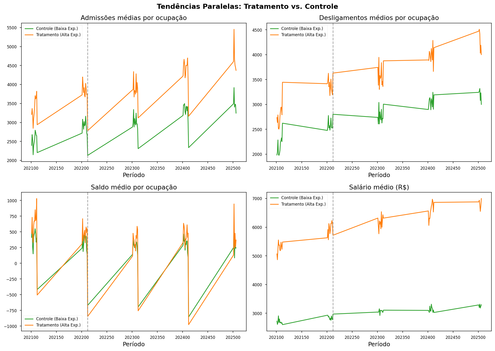
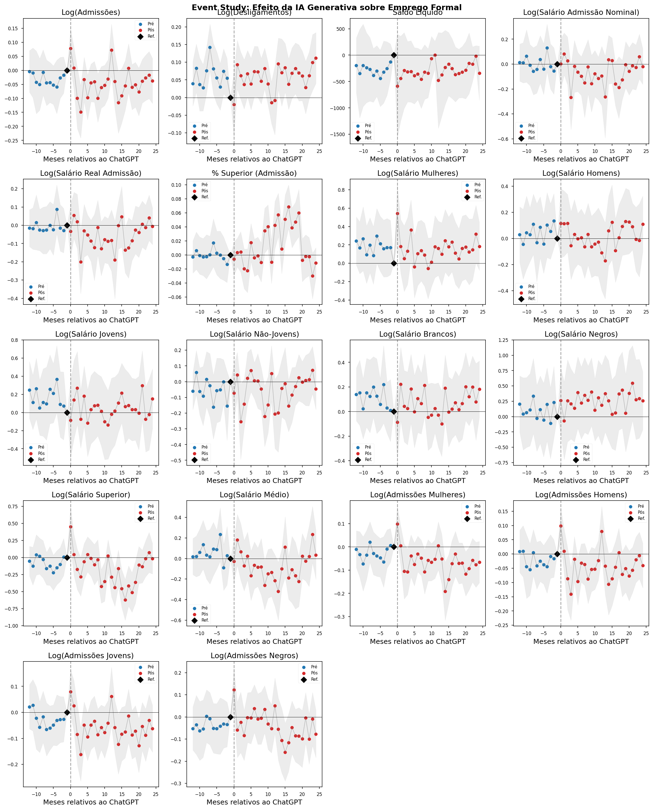
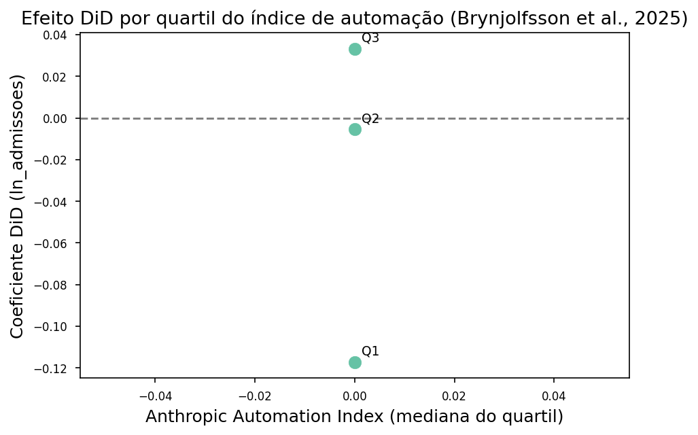

# ETAPA 2b — Análise Difference-in-Differences: IA Generativa e Emprego
Formal no Brasil


**Dissertação:** Inteligência Artificial Generativa e o Mercado de
Trabalho Brasileiro: Uma Análise de Exposição Ocupacional e seus Efeitos
Distributivos.

**Aluno:** Manoel Brasil Orlandi

**Objetivo deste notebook:** Estimar o efeito causal do lançamento da IA
generativa (ChatGPT, novembro/2022) sobre o mercado de trabalho formal
brasileiro, usando variação na exposição ocupacional à IA como fonte de
identificação. Implementa um design Difference-in-Differences (DiD) com
dados do CAGED (2021–2025) e o índice de exposição da OIT.

**Pergunta de pesquisa:** Após o lançamento do ChatGPT, ocupações mais
expostas à IA generativa tiveram mudanças diferenciais em contratações,
demissões ou salários de admissão, em comparação com ocupações menos
expostas?

**Input:** `data/output/painel_caged_did_ready.parquet` (produzido no
Notebook 2a).

**Estratégia de crosswalk:** Análise principal a 2 dígitos ISCO-08
(match por Sub-major Group com fallback a Major Group), com robustez a 4
dígitos via correspondência ISCO-88↔ISCO-08 e fallback hierárquico em 6
níveis.

**Referências metodológicas:** Hui, Reshef & Zhou (2024), *The
Short-Term Effects of Generative AI on Employment*; Cunningham (2021),
*Causal Inference: The Mixtape*, Cap. 9; Callaway & Sant’Anna (2021),
*DiD with multiple time periods*; Gmyrek, Berg & Cappelli (2025), ILO
Working Paper 140.

### Estratégia de identificação

| Elemento | Definição |
|----|----|
| **Unidade de análise** | Ocupação CBO × mês (2 dígitos na espec. principal; 4 dígitos na robustez) |
| **Tratamento** | Ocupações com alta exposição à IA (top 20% do índice ILO via `exposure_score_2d`) |
| **Controle** | Ocupações com baixa exposição (bottom 80%) |
| **Evento** | Lançamento do ChatGPT (30/nov/2022) |
| **Pré-tratamento** | Jan/2021 — Nov/2022 (23 meses) |
| **Pós-tratamento** | Dez/2022 — Jun/2025 (31 meses) |
| **Outcomes** | Admissões, desligamentos, saldo, salário médio de admissão |
| **Efeitos fixos** | Ocupação (CBO 4d) + período (ano-mês) |
| **Erros padrão** | Clusterizados por ocupação (CBO 4d) |

A hipótese central é que, **na ausência do lançamento do ChatGPT**,
ocupações de alta e baixa exposição teriam seguido tendências paralelas.
Com **tratamento sharp** (todos tratados no mesmo momento), o estimador
TWFE produz estimativas consistentes do ATT médio (Cunningham, Mixtape
Cap. 9).

### Outcomes

| Outcome | Variável | Transformação | Interpretação |
|----|----|----|----|
| Contratações | `admissoes` | `ln_admissoes = log(admissoes + 1)` | Fluxo de novas contratações |
| Demissões | `desligamentos` | `ln_desligamentos = log(desligamentos + 1)` | Fluxo de demissões |
| Saldo líquido | `saldo` | Em nível | Criação líquida de empregos |
| Salário de admissão (nominal) | `salario_medio_adm` | `ln_salario_adm = log(salario_medio_adm)` | Poder de barganha / demanda |
| Salário de admissão (**real**) | `salario_real_adm` (2a) | `ln_salario_real_adm` (deflacionado IPCA) | **Análise principal** — limpa inflação |

**Nota — Winsorização:** O Notebook 2a identificou outlier salarial em
Jun/2025. Aplicamos **winsorização nos percentis 1% e 99%** de
`salario_medio_adm` e `salario_sm` neste notebook antes da estimação,
preservando todas as observações.

### 1. Configuração do ambiente

Importar bibliotecas, definir caminhos e parâmetros de estimação.
Caminhos relativos ao diretório `notebook/`.

> **Sobre os avisos de colinearidade:** O pyfixest pode exibir
> *UserWarning* quando uma variável de controle (ex.: `pct_mulher_adm`)
> é omitida por **colinearidade** com os efeitos fixos (ocupação e
> período). Isso ocorre quando a variável tem pouca ou nenhuma variação
> dentro dos grupos. Não é erro: a estimação segue válida; o controle
> simplesmente não entra na regressão. Suprimimos esses avisos para
> deixar o notebook mais legível.

``` python
# Verificar dependências e instalar apenas o que faltar (rode esta célula primeiro)
import importlib.util
import subprocess
import sys

# (nome para import, nome para pip install)
PACOTES = [
    ("pandas", "pandas"),
    ("numpy", "numpy"),
    ("pyfixest", "pyfixest"),
    ("matplotlib", "matplotlib"),
    ("seaborn", "seaborn"),
    ("scipy", "scipy"),
    ("pyarrow", "pyarrow"),
]

def ja_instalado(nome_import):
    return importlib.util.find_spec(nome_import) is not None

faltando = [pip for imp, pip in PACOTES if not ja_instalado(imp)]
if faltando:
    subprocess.check_call([sys.executable, "-m", "pip", "install", "-q"] + faltando)
    print("Instalado:", ", ".join(faltando))
else:
    print("Todas as dependências já estão instaladas.")
```

    Todas as dependências já estão instaladas.

``` python
# Etapa 2b.1 — Configuração do ambiente

import warnings
import pandas as pd
import numpy as np
import pyfixest as pf
import matplotlib.pyplot as plt
import seaborn as sns
from pathlib import Path
from scipy import stats

warnings.filterwarnings("ignore", category=FutureWarning)
# Suprimir aviso do pyfixest quando variável é omitida por colinearidade (ex.: pct_mulher_adm)
warnings.filterwarnings("ignore", message=".*dropped due to multicollinearity.*", category=UserWarning)

DATA_OUTPUT    = Path("../../data/output")
OUTPUTS_TABLES = Path("../../outputs/tables")
OUTPUTS_FIGURES = Path("../../outputs/figures")
OUTPUTS_LOGS   = Path("../../outputs/logs")
for d in [OUTPUTS_TABLES, OUTPUTS_FIGURES, OUTPUTS_LOGS]:
    d.mkdir(parents=True, exist_ok=True)

TREATMENT_VAR    = 'alta_exp'
TREATMENT_VAR_4D  = 'alta_exp_4d'
CLUSTER_VAR      = 'cbo_4d'
VCOV_SPEC        = {'CRV1': 'cbo_4d'}
REFERENCE_PERIOD  = -1
ALPHA             = 0.05
ANO_TRATAMENTO   = 2022
MES_TRATAMENTO   = 12

OUTCOMES = {
    'ln_admissoes':       'Log(Admissões)',
    'ln_desligamentos':   'Log(Desligamentos)',
    'saldo':              'Saldo Líquido',
    'ln_salario_adm':     'Log(Salário Admissão Nominal)',
    'ln_salario_real_adm':'Log(Salário Real Admissão)',
    'pct_superior_adm':   '% Superior (Admissão)',
    # Heterogeneidade demográfica (salários por grupo)
    'ln_salario_mulher':  'Log(Salário Mulheres)',
    'ln_salario_homem':   'Log(Salário Homens)',
    'ln_salario_jovem':   'Log(Salário Jovens)',
    'ln_salario_naojovem':'Log(Salário Não-Jovens)',
    'ln_salario_branco':  'Log(Salário Brancos)',
    'ln_salario_negro':   'Log(Salário Negros)',
    'ln_salario_superior':'Log(Salário Superior)',
    'ln_salario_medio':   'Log(Salário Médio)',
    'ln_admissoes_mulher':'Log(Admissões Mulheres)',
    'ln_admissoes_homem': 'Log(Admissões Homens)',
    'ln_admissoes_jovem': 'Log(Admissões Jovens)',
    'ln_admissoes_negro': 'Log(Admissões Negros)',
}
OUTCOMES_SECONDARY = {'ln_salario_sm': 'Log(Salário em SM)'}

plt.style.use('seaborn-v0_8-paper')
sns.set_palette("Set2")
plt.rcParams.update({'font.size': 11, 'axes.titlesize': 13, 'axes.labelsize': 12, 'figure.dpi': 150})
COLORS = {'pre': '#1f77b4', 'post': '#d62728', 'ci': '#cccccc', 'treated': '#ff7f0e', 'control': '#2ca02c'}

print("Configuração carregada.")
```

    Configuração carregada.

### 2. Carregar e explorar dados

Carregar o painel produzido no Notebook 2a, aplicar winsorização P1/P99
nos salários e recalcular os logs. Em seguida, exibir estatísticas
descritivas dos outcomes.

``` python
# Etapa 2b.2 — Carregar e explorar dados

painel_path = DATA_OUTPUT / "painel_caged_did_ready.parquet"
df = pd.read_parquet(painel_path)

print(f"Painel carregado: {len(df):,} observações")
print(f"Ocupações: {df['cbo_4d'].nunique()}")
print(f"Períodos: {df['periodo'].nunique()} meses")
print(f"Tratamento ({TREATMENT_VAR}): Alta exposição: {df[TREATMENT_VAR].mean():.1%}")
print(f"  Pré: {df[df['post']==0].shape[0]:,} obs | Pós: {df[df['post']==1].shape[0]:,} obs")
# Colunas Anthropic (Anexo 1 — Automation vs Augmentation)
anth_cols = ['anthropic_automation_index', 'is_automation', 'is_augmentation']
for ac in anth_cols:
    if ac in df.columns:
        print(f"  {ac}: presente")
    else:
        print(f"  AVISO: {ac} ausente (rode o Anexo 1 no Notebook 2a)")

for col_sal in ['salario_medio_adm', 'salario_sm']:
    if col_sal in df.columns:
        p1, p99 = df[col_sal].quantile(0.01), df[col_sal].quantile(0.99)
        lower = max(float(p1), 0.01) if p1 <= 0 else float(p1)
        n_clip = ((df[col_sal] < lower) | (df[col_sal] > p99)).sum()
        df[col_sal] = df[col_sal].clip(lower=lower, upper=p99)
        print(f"Winsorização {col_sal}: [{lower:.2f}, {p99:.2f}], {n_clip} obs clipped")
df['ln_salario_adm'] = np.log(df['salario_medio_adm'])
df['ln_salario_sm'] = np.log(df['salario_sm'])

print("\nEstatísticas descritivas dos outcomes:")
for var, label in {**OUTCOMES, **OUTCOMES_SECONDARY}.items():
    if var in df.columns:
        print(f"  {label}: N={df[var].notna().sum():,}, média={df[var].mean():.3f}, std={df[var].std():.3f}")
```

    Painel carregado: 32,988 observações
    Ocupações: 629
    Períodos: 54 meses
    Tratamento (alta_exp): Alta exposição: 20.3%
      Pré: 14,058 obs | Pós: 18,930 obs
      anthropic_automation_index: presente
      is_automation: presente
      is_augmentation: presente
    Winsorização salario_medio_adm: [0.01, 25908.75], 678 obs clipped
    Winsorização salario_sm: [0.01, 20.37], 678 obs clipped

    Estatísticas descritivas dos outcomes:
      Log(Admissões): N=32,988, média=5.657, std=2.291
      Log(Desligamentos): N=32,988, média=5.629, std=2.257
      Saldo Líquido: N=32,988, média=279.879, std=2322.995
      Log(Salário Admissão Nominal): N=32,988, média=7.813, std=1.426
      Log(Salário Real Admissão): N=32,988, média=7.951, std=1.049
      % Superior (Admissão): N=32,988, média=0.215, std=0.264
      Log(Salário Mulheres): N=32,988, média=7.422, std=1.880
      Log(Salário Homens): N=32,988, média=7.809, std=1.302
      Log(Salário Jovens): N=32,988, média=7.511, std=1.435
      Log(Salário Não-Jovens): N=32,988, média=7.869, std=1.299
      Log(Salário Brancos): N=32,988, média=7.795, std=1.452
      Log(Salário Negros): N=32,988, média=7.005, std=2.536
      Log(Salário Superior): N=32,988, média=7.253, std=2.604
      Log(Salário Médio): N=32,988, média=7.709, std=1.213
      Log(Admissões Mulheres): N=32,988, média=4.116, std=2.397
      Log(Admissões Homens): N=32,988, média=5.179, std=2.261
      Log(Admissões Jovens): N=32,988, média=4.746, std=2.317
      Log(Admissões Negros): N=32,988, média=3.122, std=2.088
      Log(Salário em SM): N=32,988, média=0.732, std=0.830

### 3. Tabela de balanço (pré-tratamento)

Comparar características das ocupações tratadas vs. controle no período
pré-tratamento. Critério de balanço: \|diferença normalizada\| \< 0,25
(diferença em unidades de desvio-padrão pooled). Variáveis com ⚠️
indicam desbalance. *Ref. Mixtape Cap. 9:* uma tabela de balanço compara
as características pré-tratamento dos grupos; diferenças substanciais
tornam a hipótese de tendências paralelas menos plausível.

``` python
# Etapa 2b.3 — Tabela de balanço

df_pre = df[df['post'] == 0].copy()
ocup_pre = df_pre.groupby('cbo_4d').agg(
    alta_exp=('alta_exp', 'first'),
    admissoes_media=('admissoes', 'mean'),
    desligamentos_media=('desligamentos', 'mean'),
    saldo_media=('saldo', 'mean'),
    salario_media=('salario_medio_adm', 'mean'),
    idade_media=('idade_media_adm', 'mean'),
    pct_mulher=('pct_mulher_adm', 'mean'),
    pct_superior=('pct_superior_adm', 'mean'),
    n_meses=('periodo', 'nunique'),
).reset_index()

BALANCE_THRESHOLD = 0.25
covariates = {'admissoes_media': 'Admissões (média)', 'desligamentos_media': 'Desligamentos (média)',
              'saldo_media': 'Saldo (média)', 'salario_media': 'Salário médio (R$)',
              'idade_media': 'Idade média', 'pct_mulher': '% Mulheres', 'pct_superior': '% Superior', 'n_meses': 'Meses'}
results_balance = []
for var, label in covariates.items():
    treated = ocup_pre[ocup_pre['alta_exp']==1][var].dropna()
    control = ocup_pre[ocup_pre['alta_exp']==0][var].dropna()
    mean_t, mean_c = treated.mean(), control.mean()
    pooled_std = np.sqrt((treated.var() + control.var()) / 2)
    std_diff = (mean_t - mean_c) / pooled_std if pooled_std > 0 else np.nan
    results_balance.append({'Variável': label, 'Controle': mean_c, 'Tratamento': mean_t, 'Diff. Normalizada': std_diff,
                            'Balanceado': '✓' if abs(std_diff) < BALANCE_THRESHOLD else '⚠️'})
df_balance = pd.DataFrame(results_balance)
print(df_balance.to_string(index=False))
df_balance.to_csv(OUTPUTS_TABLES / 'balance_table_pre.csv', index=False)
```

                 Variável    Controle  Tratamento  Diff. Normalizada Balanceado
        Admissões (média) 2655.337806 3409.836736           0.060150          ✓
    Desligamentos (média) 2321.326358 2916.919394           0.055214          ✓
            Saldo (média)  334.011448  492.917342           0.086523          ✓
       Salário médio (R$) 2738.765085 5388.205892           0.684567         ⚠️
              Idade média   32.752803   31.799216          -0.172254          ✓
               % Mulheres    0.278944    0.441422           0.696466         ⚠️
               % Superior    0.155741    0.418939           1.150136         ⚠️
                    Meses   22.570565   21.854962          -0.218711          ✓

### 4. Tendências paralelas (inspeção visual)

Evolução temporal das métricas de emprego para tratamento vs. controle.
A hipótese de tendências paralelas exige que ambos os grupos sigam
trajetórias semelhantes **antes** do evento (Nov/2022). A linha vertical
marca o lançamento do ChatGPT; se as curvas já divergiam antes dela, a
interpretação causal do DiD fica comprometida.

``` python
# Etapa 2b.4 — Tendências paralelas (visual)

ts_grupo = df.groupby(['periodo_num', 'alta_exp']).agg(
    admissoes_total=('admissoes', 'sum'), desligamentos_total=('desligamentos', 'sum'),
    saldo_total=('saldo', 'sum'), salario_medio=('salario_medio_adm', 'mean'),
    n_ocupacoes=('cbo_4d', 'nunique')).reset_index()
for col in ['admissoes_total', 'desligamentos_total', 'saldo_total']:
    ts_grupo[f'{col}_per_ocup'] = ts_grupo[col] / ts_grupo['n_ocupacoes']
ts_grupo['grupo'] = ts_grupo['alta_exp'].map({0: 'Controle (Baixa Exp.)', 1: 'Tratamento (Alta Exp.)'})

outcomes_plot = {'admissoes_total_per_ocup': 'Admissões médias por ocupação',
                 'desligamentos_total_per_ocup': 'Desligamentos médios por ocupação',
                 'saldo_total_per_ocup': 'Saldo médio por ocupação', 'salario_medio': 'Salário médio (R$)'}
fig, axes = plt.subplots(2, 2, figsize=(14, 10))
evento_periodo = ANO_TRATAMENTO * 100 + MES_TRATAMENTO
for i, (var, title) in enumerate(outcomes_plot.items()):
    ax = axes.flat[i]
    for grupo in ['Controle (Baixa Exp.)', 'Tratamento (Alta Exp.)']:
        data = ts_grupo[ts_grupo['grupo']==grupo]
        color = COLORS['control'] if 'Controle' in grupo else COLORS['treated']
        ax.plot(data['periodo_num'], data[var], label=grupo, color=color, linewidth=1.5)
    ax.axvline(x=evento_periodo, color='gray', linestyle='--', alpha=0.7)
    ax.set_title(title); ax.set_xlabel('Período'); ax.legend(fontsize=8)
plt.suptitle('Tendências Paralelas: Tratamento vs. Controle', fontsize=14, fontweight='bold')
plt.tight_layout()
plt.savefig(OUTPUTS_FIGURES / 'parallel_trends_all_outcomes.png', dpi=150, bbox_inches='tight')
plt.show()
```



### 5a. Estimação DiD principal

Seis modelos por outcome: (1) DiD básico, (2) com FE, (3) **PRINCIPAL**
FE + controles 2d, (4) tratamento contínuo 2d, (5) robustez FE+controles
4d, (6) contínuo 4d. Erros clusterizados por ocupação (CBO 4d).

``` python
# Etapa 2b.5a — Estimação DiD principal

df_reg = df.copy()
for col in ['admissoes','desligamentos','saldo','ln_admissoes','ln_desligamentos','ln_salario_adm','ln_salario_real_adm',
            'idade_media_adm','pct_mulher_adm','pct_superior_adm','post','alta_exp','exposure_score_2d','exposure_score_4d']:
    if col in df_reg.columns: df_reg[col] = pd.to_numeric(df_reg[col], errors='coerce')
df_reg['post_alta'] = df_reg['post'] * df_reg['alta_exp']
df_reg['post_exposure_2d'] = df_reg['post'] * df_reg['exposure_score_2d']
df_reg['post_alta_4d'] = df_reg['post'] * df_reg['alta_exp_4d']
df_reg['post_exposure_4d'] = df_reg['post'] * df_reg['exposure_score_4d']

def estimate_did(df_in, outcome, formula, label):
    try:
        model = pf.feols(formula, data=df_in, vcov=VCOV_SPEC)
        names = model.coef().index.tolist()
        did_name = [c for c in names if 'post' in c.lower() and ('alta' in c.lower() or 'exposure' in c.lower())]
        if not did_name: did_name = [names[0]]
        name = did_name[0]
        coef = float(model.coef().loc[name]); se = float(model.se().loc[name]); pval = float(model.pvalue().loc[name])
        stars = '***' if pval < 0.01 else '**' if pval < 0.05 else '*' if pval < 0.10 else ''
        return {'model': label, 'outcome': outcome, 'coef': coef, 'se': se, 'p_value': pval, 'stars': stars, 'n_obs': len(df_in), 'n_clusters': None}
    except Exception as e: print(f"  ERRO {label}/{outcome}: {e}"); return None

all_results = []
controls_base = ['idade_media_adm', 'pct_mulher_adm', 'pct_superior_adm']
for outcome, label in OUTCOMES.items():
    if outcome not in df_reg.columns: continue
    df_out = df_reg[df_reg[outcome].notna()].copy()
    controls = [c for c in controls_base if c != outcome]
    ctrl_str = ' + '.join(controls) if controls else ''
    formula_m3 = f"{outcome} ~ post_alta + {ctrl_str} | cbo_4d + periodo" if ctrl_str else f"{outcome} ~ post_alta | cbo_4d + periodo"
    formula_m4 = f"{outcome} ~ post_exposure_2d + {ctrl_str} | cbo_4d + periodo" if ctrl_str else f"{outcome} ~ post_exposure_2d | cbo_4d + periodo"
    for r in [estimate_did(df_out, outcome, f"{outcome} ~ post_alta + post + alta_exp", "Model 1: Basic"),
               estimate_did(df_out, outcome, f"{outcome} ~ post_alta | cbo_4d + periodo", "Model 2: FE"),
               estimate_did(df_out, outcome, formula_m3, "Model 3: FE + Controls (MAIN)"),
               estimate_did(df_out, outcome, formula_m4, "Model 4: Continuous (2d)")]:
        if r: all_results.append(r)
    df_4d = df_out[df_out['exposure_score_4d'].notna()].copy()
    formula_m5 = f"{outcome} ~ post_alta_4d + {ctrl_str} | cbo_4d + periodo" if ctrl_str else f"{outcome} ~ post_alta_4d | cbo_4d + periodo"
    formula_m6 = f"{outcome} ~ post_exposure_4d + {ctrl_str} | cbo_4d + periodo" if ctrl_str else f"{outcome} ~ post_exposure_4d | cbo_4d + periodo"
    for r in [estimate_did(df_4d, outcome, formula_m5, "Model 5: FE + Controls (4d)"),
              estimate_did(df_4d, outcome, formula_m6, "Model 6: Continuous (4d)")]:
        if r: all_results.append(r)

df_results = pd.DataFrame(all_results)
df_results.to_csv(OUTPUTS_TABLES / 'did_main_results.csv', index=False)
print("Model 3 (PRINCIPAL):")
print(df_results[df_results['model']=='Model 3: FE + Controls (MAIN)'][['outcome','coef','se','p_value','stars']].to_string(index=False))
```

    Model 3 (PRINCIPAL):
                outcome       coef        se  p_value stars
           ln_admissoes  -0.027130  0.026402 0.304556      
       ln_desligamentos   0.019000  0.026814 0.478853      
                  saldo -77.674731 69.625480 0.265017      
         ln_salario_adm  -0.065617  0.027789 0.018518    **
    ln_salario_real_adm  -0.034081  0.019308 0.078023     *
       pct_superior_adm   0.010283  0.004275 0.016447    **
      ln_salario_mulher  -0.044537  0.036202 0.219064      
       ln_salario_homem   0.003889  0.026967 0.885390      
       ln_salario_jovem  -0.133735  0.052203 0.010644    **
    ln_salario_naojovem   0.002496  0.027484 0.927677      
      ln_salario_branco  -0.028496  0.035817 0.426566      
       ln_salario_negro   0.110582  0.067872 0.103757      
    ln_salario_superior  -0.077509  0.040513 0.056178     *
       ln_salario_medio  -0.084545  0.031741 0.007930   ***
    ln_admissoes_mulher  -0.046679  0.026165 0.074905     *
     ln_admissoes_homem  -0.034969  0.026214 0.182701      
     ln_admissoes_jovem  -0.055804  0.028659 0.051962     *
     ln_admissoes_negro  -0.003190  0.027197 0.906666      

### 5b. Checkpoint — Resultados DiD

Resumo dos resultados principais (Model 3) e robustez (Model 5),
consistência 2d vs 4d.

``` python
# Etapa 2b.5b — Checkpoint

main_results = df_results[df_results['model'] == 'Model 3: FE + Controls (MAIN)']
rob_4d = df_results[df_results['model'] == 'Model 5: FE + Controls (4d)']
print("Model 3 (2d):"); [print(f"  {OUTCOMES.get(r['outcome'],r['outcome'])}: β={r['coef']:.4f}{r.get('stars','')} (p={r['p_value']:.3f})") for _,r in main_results.iterrows()]
print("Model 5 (4d):"); [print(f"  {OUTCOMES.get(r['outcome'],r['outcome'])}: β={r['coef']:.4f}{r.get('stars','')} (p={r['p_value']:.3f})") for _,r in rob_4d.iterrows()]
print("Consistência 2d vs 4d:")
for outcome in OUTCOMES:
    r2 = main_results[main_results['outcome']==outcome]; r4 = rob_4d[rob_4d['outcome']==outcome]
    if len(r2)>0 and len(r4)>0: print(f"  {outcome}: {'✓ mesma direção' if (r2.iloc[0]['coef']*r4.iloc[0]['coef'])>0 else '⚠ opostas'} (2d: {r2.iloc[0]['coef']:.4f}, 4d: {r4.iloc[0]['coef']:.4f})")
```

    Model 3 (2d):
      Log(Admissões): β=-0.0271 (p=0.305)
      Log(Desligamentos): β=0.0190 (p=0.479)
      Saldo Líquido: β=-77.6747 (p=0.265)
      Log(Salário Admissão Nominal): β=-0.0656** (p=0.019)
      Log(Salário Real Admissão): β=-0.0341* (p=0.078)
      % Superior (Admissão): β=0.0103** (p=0.016)
      Log(Salário Mulheres): β=-0.0445 (p=0.219)
      Log(Salário Homens): β=0.0039 (p=0.885)
      Log(Salário Jovens): β=-0.1337** (p=0.011)
      Log(Salário Não-Jovens): β=0.0025 (p=0.928)
      Log(Salário Brancos): β=-0.0285 (p=0.427)
      Log(Salário Negros): β=0.1106 (p=0.104)
      Log(Salário Superior): β=-0.0775* (p=0.056)
      Log(Salário Médio): β=-0.0845*** (p=0.008)
      Log(Admissões Mulheres): β=-0.0467* (p=0.075)
      Log(Admissões Homens): β=-0.0350 (p=0.183)
      Log(Admissões Jovens): β=-0.0558* (p=0.052)
      Log(Admissões Negros): β=-0.0032 (p=0.907)
    Model 5 (4d):
      Log(Admissões): β=-0.0247 (p=0.353)
      Log(Desligamentos): β=0.0196 (p=0.456)
      Saldo Líquido: β=-142.4436* (p=0.053)
      Log(Salário Admissão Nominal): β=-0.0679** (p=0.013)
      Log(Salário Real Admissão): β=-0.0449** (p=0.024)
      % Superior (Admissão): β=0.0061 (p=0.130)
      Log(Salário Mulheres): β=-0.0484 (p=0.227)
      Log(Salário Homens): β=-0.0157 (p=0.554)
      Log(Salário Jovens): β=-0.1803*** (p=0.000)
      Log(Salário Não-Jovens): β=-0.0179 (p=0.485)
      Log(Salário Brancos): β=-0.0342 (p=0.317)
      Log(Salário Negros): β=0.0361 (p=0.606)
      Log(Salário Superior): β=-0.0683* (p=0.090)
      Log(Salário Médio): β=-0.1147*** (p=0.000)
      Log(Admissões Mulheres): β=-0.0408 (p=0.129)
      Log(Admissões Homens): β=-0.0310 (p=0.240)
      Log(Admissões Jovens): β=-0.0520* (p=0.069)
      Log(Admissões Negros): β=-0.0132 (p=0.640)
    Consistência 2d vs 4d:
      ln_admissoes: ✓ mesma direção (2d: -0.0271, 4d: -0.0247)
      ln_desligamentos: ✓ mesma direção (2d: 0.0190, 4d: 0.0196)
      saldo: ✓ mesma direção (2d: -77.6747, 4d: -142.4436)
      ln_salario_adm: ✓ mesma direção (2d: -0.0656, 4d: -0.0679)
      ln_salario_real_adm: ✓ mesma direção (2d: -0.0341, 4d: -0.0449)
      pct_superior_adm: ✓ mesma direção (2d: 0.0103, 4d: 0.0061)
      ln_salario_mulher: ✓ mesma direção (2d: -0.0445, 4d: -0.0484)
      ln_salario_homem: ⚠ opostas (2d: 0.0039, 4d: -0.0157)
      ln_salario_jovem: ✓ mesma direção (2d: -0.1337, 4d: -0.1803)
      ln_salario_naojovem: ⚠ opostas (2d: 0.0025, 4d: -0.0179)
      ln_salario_branco: ✓ mesma direção (2d: -0.0285, 4d: -0.0342)
      ln_salario_negro: ✓ mesma direção (2d: 0.1106, 4d: 0.0361)
      ln_salario_superior: ✓ mesma direção (2d: -0.0775, 4d: -0.0683)
      ln_salario_medio: ✓ mesma direção (2d: -0.0845, 4d: -0.1147)
      ln_admissoes_mulher: ✓ mesma direção (2d: -0.0467, 4d: -0.0408)
      ln_admissoes_homem: ✓ mesma direção (2d: -0.0350, 4d: -0.0310)
      ln_admissoes_jovem: ✓ mesma direção (2d: -0.0558, 4d: -0.0520)
      ln_admissoes_negro: ✓ mesma direção (2d: -0.0032, 4d: -0.0132)

### 6. Event study

Estimação com dummies de interação período × tratamento. O **período de
referência é t = −1** (mês antes do ChatGPT, Nov/2022), de modo que
todos os demais coeficientes são interpretados em relação a esse mês.
**Binning dos extremos** (t ≤ −12 e t ≥ 24) reduz ruído nas pontas da
janela. Coeficientes pré-tratamento não significativos e próximos de
zero sustentam a hipótese de tendências paralelas.

``` python
# Etapa 2b.6 — Event study (dummies + estimação)

BIN_MIN, BIN_MAX, ref_t = -12, 24, -1
df_es = df_reg.copy()
df_es['t_binned'] = df_es['tempo_relativo_meses'].clip(lower=BIN_MIN, upper=BIN_MAX)

def _dname(t): return f"did_tm{-t}" if t < 0 else f"did_t{t}"
did_vars = []; t_to_name = {}
for t in sorted(df_es['t_binned'].unique()):
    if t == ref_t: continue
    dname = _dname(t); t_to_name[t] = dname
    df_es[dname] = ((df_es['t_binned']==t) & (df_es['alta_exp']==1)).astype(int)
    did_vars.append(dname)

event_study_results = {}
controls_es_base = ['idade_media_adm', 'pct_mulher_adm', 'pct_superior_adm']
for outcome, label in OUTCOMES.items():
    if outcome not in df_es.columns: continue
    df_out = df_es[df_es[outcome].notna()].copy()
    controls_es = [c for c in controls_es_base if c != outcome]
    ctrl_es_str = ' + '.join(controls_es) if controls_es else ''
    formula = f"{outcome} ~ {' + '.join(did_vars)} + {ctrl_es_str} | cbo_4d + periodo" if ctrl_es_str else f"{outcome} ~ {' + '.join(did_vars)} | cbo_4d + periodo"
    try:
        model = pf.feols(formula, data=df_out, vcov=VCOV_SPEC)
        idx = model.coef().index.tolist()
        coefs = []
        for t in sorted(df_es['t_binned'].unique()):
            if t == ref_t: coefs.append({'t':t,'coef':0,'se':0,'p_value':np.nan,'is_reference':True,'is_pre':t<0})
            else:
                dname = t_to_name.get(t, _dname(t))
                if dname in idx: coefs.append({'t':t,'coef':float(model.coef().loc[dname]),'se':float(model.se().loc[dname]),'p_value':float(model.pvalue().loc[dname]),'is_reference':False,'is_pre':t<0})
        df_c = pd.DataFrame(coefs); df_c['ci_low'] = df_c['coef'] - 1.96*df_c['se']; df_c['ci_high'] = df_c['coef'] + 1.96*df_c['se']
        event_study_results[outcome] = df_c
        df_c.to_csv(OUTPUTS_TABLES / f'event_study_{outcome}.csv', index=False)
    except Exception as e: print(f"  ERRO {outcome}: {e}")
print(f"Event study salvo para {len(event_study_results)} outcomes.")
```

    Event study salvo para 18 outcomes.

``` python
# Etapa 2b.6 (cont.) — Gráficos do event study

outcomes_with_results = [(o, OUTCOMES[o]) for o in OUTCOMES if o in event_study_results]
n_plot = len(outcomes_with_results)
n_cols = 4
n_rows = max(1, (n_plot + n_cols - 1) // n_cols)
fig, axes = plt.subplots(n_rows, n_cols, figsize=(4 * n_cols, 4 * n_rows))
axes = np.atleast_1d(axes).flat
for j in range(n_plot, len(axes)):
    axes[j].set_visible(False)
for i, (outcome, label) in enumerate(outcomes_with_results):
    ax = axes[i]
    df_c = event_study_results[outcome]
    ax.fill_between(df_c['t'], df_c['ci_low'], df_c['ci_high'], alpha=0.15, color='gray')
    pre = df_c[df_c['is_pre'] & ~df_c['is_reference']]; post = df_c[~df_c['is_pre'] & ~df_c['is_reference']]; ref = df_c[df_c['is_reference']]
    ax.scatter(pre['t'], pre['coef'], color=COLORS['pre'], s=30, label='Pré'); ax.scatter(post['t'], post['coef'], color=COLORS['post'], s=30, label='Pós')
    ax.scatter(ref['t'], ref['coef'], color='black', s=60, marker='D', label='Ref.')
    ax.plot(df_c['t'], df_c['coef'], color='gray', linewidth=0.8, alpha=0.5)
    ax.axhline(y=0, color='black', linewidth=0.5); ax.axvline(x=0, color='gray', linestyle='--', alpha=0.7)
    ax.set_title(label); ax.set_xlabel('Meses relativos ao ChatGPT'); ax.legend(fontsize=7)
plt.suptitle('Event Study: Efeito da IA Generativa sobre Emprego Formal', fontsize=14, fontweight='bold')
plt.tight_layout(); plt.savefig(OUTPUTS_FIGURES / 'event_study_all_outcomes.png', dpi=150, bbox_inches='tight'); plt.show()
```



### 6b. Teste formal de tendências paralelas

H₀: todos os coeficientes pré-tratamento são conjuntamente zero. Se
rejeitarmos (ou se vários pré forem individualmente significativos), há
preocupação com a hipótese de tendências paralelas.

``` python
# Etapa 2b.6b — Teste formal tendências paralelas

results_pt = []
for outcome, label in OUTCOMES.items():
    if outcome not in event_study_results: continue
    df_c = event_study_results[outcome]
    pre_coefs = df_c[df_c['is_pre'] & ~df_c['is_reference']]
    if len(pre_coefs)==0: continue
    n_sig = (pre_coefs['p_value'] < 0.05).sum()
    se_nz = pre_coefs['se'].replace(0, np.nan); max_t = (pre_coefs['coef']/se_nz).abs().max() if se_nz.notna().any() else 0
    t_stats = (pre_coefs['coef']/pre_coefs['se'].replace(0,np.nan)).fillna(0).values; n_pre = len(t_stats)
    p_joint = 1 - stats.chi2.cdf(np.mean(t_stats**2)*n_pre, df=n_pre)
    status = 'PARALELAS' if n_sig==0 and p_joint>0.10 else 'PREOCUPAÇÃO'
    results_pt.append({'Outcome': label, 'N coefs pré': n_pre, 'Sig. (p<0.05)': int(n_sig), 'p-valor conjunto': f'{p_joint:.3f}', 'Status': status})
    print(f"{label}: {n_sig} pré sig., p_joint={p_joint:.3f} → {status}")
pd.DataFrame(results_pt).to_csv(OUTPUTS_TABLES / 'parallel_trends_test.csv', index=False)
```

    Log(Admissões): 0 pré sig., p_joint=0.639 → PARALELAS
    Log(Desligamentos): 5 pré sig., p_joint=0.000 → PREOCUPAÇÃO
    Saldo Líquido: 0 pré sig., p_joint=0.396 → PARALELAS
    Log(Salário Admissão Nominal): 0 pré sig., p_joint=0.985 → PARALELAS
    Log(Salário Real Admissão): 0 pré sig., p_joint=0.993 → PARALELAS
    % Superior (Admissão): 0 pré sig., p_joint=0.996 → PARALELAS
    Log(Salário Mulheres): 0 pré sig., p_joint=0.073 → PREOCUPAÇÃO
    Log(Salário Homens): 0 pré sig., p_joint=0.958 → PARALELAS
    Log(Salário Jovens): 0 pré sig., p_joint=0.265 → PARALELAS
    Log(Salário Não-Jovens): 0 pré sig., p_joint=0.696 → PARALELAS
    Log(Salário Brancos): 0 pré sig., p_joint=0.516 → PARALELAS
    Log(Salário Negros): 0 pré sig., p_joint=0.983 → PARALELAS
    Log(Salário Superior): 0 pré sig., p_joint=0.657 → PARALELAS
    Log(Salário Médio): 0 pré sig., p_joint=0.825 → PARALELAS
    Log(Admissões Mulheres): 0 pré sig., p_joint=0.853 → PARALELAS
    Log(Admissões Homens): 0 pré sig., p_joint=0.884 → PARALELAS
    Log(Admissões Jovens): 0 pré sig., p_joint=0.696 → PARALELAS
    Log(Admissões Negros): 0 pré sig., p_joint=0.894 → PARALELAS

### 7. Análise de heterogeneidade (Triple-DiD)

Testar se o efeito da IA é heterogêneo por composição das admissões:
idade (jovem ≤30), gênero (% mulher \> mediana), educação (% superior \>
mediana). O coeficiente da tripla interação (Post × AltaExp × Grupo)
captura o efeito diferencial para o subgrupo.

``` python
# Etapa 2b.7 — Heterogeneidade (Triple-DiD)

df_het = df_reg.copy()
pre_mask = df_het['post']==0
med_mulher = df_het.loc[pre_mask, 'pct_mulher_adm'].median(); med_educ = df_het.loc[pre_mask, 'pct_superior_adm'].median()
df_het['jovem_adm'] = (df_het['idade_media_adm'] <= 30).astype(int)
df_het['feminino_adm'] = (df_het['pct_mulher_adm'] > med_mulher).astype(int)
df_het['alta_educ_adm'] = (df_het['pct_superior_adm'] > med_educ).astype(int)

HET_GROUPS = {'jovem_adm': 'Idade (jovem ≤30)', 'feminino_adm': 'Gênero (feminino)', 'alta_educ_adm': 'Educação (superior)'}
results_het = []
for group_var, group_label in HET_GROUPS.items():
    df_het['post_alta'] = df_het['post']*df_het['alta_exp']; df_het['post_group'] = df_het['post']*df_het[group_var]
    df_het['alta_group'] = df_het['alta_exp']*df_het[group_var]; df_het['post_alta_group'] = df_het['post']*df_het['alta_exp']*df_het[group_var]
    for outcome, out_label in OUTCOMES.items():
        if outcome not in df_het.columns: continue
        ctrl_het = [c for c in ['idade_media_adm', 'pct_mulher_adm', 'pct_superior_adm'] if c != outcome]
        ctrl_het_str = ' + '.join(ctrl_het) if ctrl_het else ''
        formula_het = f"{outcome} ~ post_alta_group + post_alta + post_group + alta_group + {ctrl_het_str} | cbo_4d + periodo" if ctrl_het_str else f"{outcome} ~ post_alta_group + post_alta + post_group + alta_group | cbo_4d + periodo"
        try:
            model = pf.feols(formula_het, data=df_het[df_het[outcome].notna()], vcov=VCOV_SPEC)
            if 'post_alta_group' not in model.coef().index: continue
            main_c = float(model.coef().loc['post_alta']); inter_c = float(model.coef().loc['post_alta_group']); inter_p = float(model.pvalue().loc['post_alta_group'])
            results_het.append({'outcome': outcome, 'outcome_label': out_label, 'group': group_label, 'main_effect': main_c, 'interaction': inter_c, 'interaction_pval': inter_p})
            if inter_p < 0.10: print(f"  {out_label} × {group_label}: β_inter = {inter_c:.4f} (p={inter_p:.3f})")
        except Exception as e: pass
df_het_results = pd.DataFrame(results_het)
df_het_results.to_csv(OUTPUTS_TABLES / 'heterogeneity_triple_did.csv', index=False)
print("Heterogeneidade salva.")
```

      Log(Salário Admissão Nominal) × Idade (jovem ≤30): β_inter = -0.3235 (p=0.001)
      Log(Salário Real Admissão) × Idade (jovem ≤30): β_inter = -0.1863 (p=0.002)
      % Superior (Admissão) × Idade (jovem ≤30): β_inter = -0.0205 (p=0.066)
      Log(Salário Homens) × Idade (jovem ≤30): β_inter = -0.2393 (p=0.012)
      Log(Salário Brancos) × Idade (jovem ≤30): β_inter = -0.1428 (p=0.097)
      Log(Salário Negros) × Idade (jovem ≤30): β_inter = -0.3994 (p=0.002)
      Log(Salário Superior) × Idade (jovem ≤30): β_inter = 0.1452 (p=0.090)
      Log(Salário Médio) × Idade (jovem ≤30): β_inter = -0.2012 (p=0.022)
      Log(Admissões Mulheres) × Idade (jovem ≤30): β_inter = 0.1158 (p=0.051)
      Log(Salário Homens) × Gênero (feminino): β_inter = -0.1008 (p=0.085)
      Log(Salário Jovens) × Gênero (feminino): β_inter = 0.2747 (p=0.035)
      Log(Admissões) × Educação (superior): β_inter = -0.1462 (p=0.050)
      % Superior (Admissão) × Educação (superior): β_inter = -0.0476 (p=0.001)
      Log(Salário Superior) × Educação (superior): β_inter = -0.6412 (p=0.000)
      Log(Admissões Homens) × Educação (superior): β_inter = -0.1295 (p=0.087)
      Log(Admissões Jovens) × Educação (superior): β_inter = -0.1484 (p=0.062)
      Log(Admissões Negros) × Educação (superior): β_inter = -0.1261 (p=0.074)
    Heterogeneidade salva.

### 8. Testes de robustez

Cinco testes: (1) **Cutoffs alternativos** (top 10%, 25%, mediana) —
espera-se mesma direção dos efeitos. (2) **Placebo temporal** (evento
fictício Dez/2021, só com dados pré-reais): o coeficiente deve ser não
significativo; significância indicaria efeitos espúrios. (3) **Exclusão
de TI** (CBO 21xx) — resultado principal deve permanecer estável. (4)
**Tendências diferenciais no pré** (trend × tratamento): coeficiente não
significativo apoia tendências paralelas. (5) **Crosswalk 2d vs 4d** —
mesma direção e magnitude similar reforçam robustez.

**O que foi feito:** A célula abaixo replica integralmente o script
`notebook/scripts/etapa_2b/10_robustness.py`, executando os cinco testes
no próprio notebook e gerando `outputs/tables/robustness_results.csv`.
Nenhum script externo é necessário; todo o código está documentado aqui.

``` python
# Etapa 2b.8 — Testes de robustez (código completo; replica 10_robustness.py no notebook)
# Gera outputs/tables/robustness_results.csv com os 5 testes abaixo.

PLACEBO_ANO, PLACEBO_MES = 2021, 12  # evento fictício Dez/2021 para placebo temporal
df_reg_rob = df_reg.copy()
results_robust = []

# Tendência linear para teste 4 (tendências diferenciais no pré)
if 'trend' not in df_reg_rob.columns and 'periodo_num' in df_reg_rob.columns:
    t_min = df_reg_rob['periodo_num'].min()
    df_reg_rob['trend'] = df_reg_rob['periodo_num'] - t_min

# TESTE 1: Cutoffs alternativos
print("TESTE 1: Cutoffs alternativos")
cutoff_vars = {
    "alta_exp": "Top 20% (MAIN)",
    "alta_exp_10": "Top 10%",
    "alta_exp_25": "Top 25%",
    "alta_exp_mediana": "Mediana",
}
for treat_var, treat_label in cutoff_vars.items():
    if treat_var not in df_reg_rob.columns:
        continue
    df_reg_rob[f"post_{treat_var}"] = df_reg_rob["post"] * df_reg_rob[treat_var]
    for outcome, out_label in OUTCOMES.items():
        if outcome not in df_reg_rob.columns:
            continue
        df_out = df_reg_rob[df_reg_rob[outcome].notna()].copy()
        formula = f"{outcome} ~ post_{treat_var} + idade_media_adm + pct_mulher_adm + pct_superior_adm | cbo_4d + periodo"
        try:
            model = pf.feols(formula, data=df_out, vcov=VCOV_SPEC)
            cname = f"post_{treat_var}"
            coef = float(model.coef().loc[cname])
            se = float(model.se().loc[cname])
            pval = float(model.pvalue().loc[cname])
            stars = "***" if pval < 0.01 else "**" if pval < 0.05 else "*" if pval < 0.10 else ""
            results_robust.append({"outcome": outcome, "test_type": "Alternative Cutoff", "specification": treat_label, "coef": coef, "se": se, "p_value": pval, "stars": stars})
        except Exception as e:
            print(f"  Erro: {outcome}/{treat_label}: {e}")

# TESTE 2: Placebo temporal (evento fictício Dez/2021)
print("\nTESTE 2: Placebo temporal (evento fictício Dez/2021)")
df_placebo = df_reg_rob[df_reg_rob["post"] == 0].copy()
placebo_ref = PLACEBO_ANO * 100 + PLACEBO_MES
df_placebo["post_placebo"] = (df_placebo["periodo_num"] >= placebo_ref).astype(int)
df_placebo["did_placebo"] = df_placebo["post_placebo"] * df_placebo["alta_exp"]
for outcome, out_label in OUTCOMES.items():
    if outcome not in df_placebo.columns:
        continue
    df_out = df_placebo[df_placebo[outcome].notna()].copy()
    formula = f"{outcome} ~ did_placebo + idade_media_adm + pct_mulher_adm + pct_superior_adm | cbo_4d + periodo"
    try:
        model = pf.feols(formula, data=df_out, vcov=VCOV_SPEC)
        coef = float(model.coef().loc["did_placebo"])
        se = float(model.se().loc["did_placebo"])
        pval = float(model.pvalue().loc["did_placebo"])
        stars = "***" if pval < 0.01 else "**" if pval < 0.05 else "*" if pval < 0.10 else ""
        results_robust.append({"outcome": outcome, "test_type": "Placebo", "specification": f"Placebo ({PLACEBO_MES}/{PLACEBO_ANO})", "coef": coef, "se": se, "p_value": pval, "stars": stars})
        status = "PASS" if pval > 0.10 else "FAIL"
        print(f"  {out_label}: β={coef:.4f}{stars} (p={pval:.3f}) → {status}")
    except Exception as e:
        print(f"  Erro: {outcome}: {e}")

# TESTE 3: Exclusão de ocupações de TI (CBO 21xx)
print("\nTESTE 3: Exclusão de ocupações de TI")
df_no_it = df_reg_rob[~df_reg_rob["cbo_4d"].astype(str).str.startswith("21")].copy()
print(f"  Registros sem TI: {len(df_no_it):,} (removidos: {len(df_reg_rob)-len(df_no_it):,})")
for outcome, out_label in OUTCOMES.items():
    if outcome not in df_no_it.columns:
        continue
    df_out = df_no_it[df_no_it[outcome].notna()].copy()
    formula = f"{outcome} ~ post_alta + idade_media_adm + pct_mulher_adm + pct_superior_adm | cbo_4d + periodo"
    try:
        model = pf.feols(formula, data=df_out, vcov=VCOV_SPEC)
        coef = float(model.coef().loc["post_alta"])
        se = float(model.se().loc["post_alta"])
        pval = float(model.pvalue().loc["post_alta"])
        stars = "***" if pval < 0.01 else "**" if pval < 0.05 else "*" if pval < 0.10 else ""
        results_robust.append({"outcome": outcome, "test_type": "Excl. TI", "specification": "Sem ocupações TI", "coef": coef, "se": se, "p_value": pval, "stars": stars})
    except Exception as e:
        print(f"  Erro: {outcome}: {e}")

# TESTE 4: Tendências diferenciais no pré-tratamento
print("\nTESTE 4: Tendências diferenciais pré-tratamento")
if 'trend' in df_reg_rob.columns:
    df_pre_trend = df_reg_rob[df_reg_rob["post"] == 0].copy()
    df_pre_trend["trend_alta"] = df_pre_trend["trend"] * df_pre_trend["alta_exp"]
    for outcome, out_label in OUTCOMES.items():
        if outcome not in df_pre_trend.columns:
            continue
        df_out = df_pre_trend[df_pre_trend[outcome].notna()].copy()
        formula = f"{outcome} ~ trend_alta + idade_media_adm + pct_mulher_adm + pct_superior_adm | cbo_4d + periodo"
        try:
            model = pf.feols(formula, data=df_out, vcov=VCOV_SPEC)
            coef = float(model.coef().loc["trend_alta"])
            se = float(model.se().loc["trend_alta"])
            pval = float(model.pvalue().loc["trend_alta"])
            stars = "***" if pval < 0.01 else "**" if pval < 0.05 else "*" if pval < 0.10 else ""
            results_robust.append({"outcome": outcome, "test_type": "Differential Trends", "specification": "Trend × Tratamento (pré)", "coef": coef, "se": se, "p_value": pval, "stars": stars})
            status = "OK" if pval > 0.10 else "PREOCUPAÇÃO"
            print(f"  {out_label}: β_trend={coef:.6f}{stars} (p={pval:.3f}) → {status}")
        except Exception as e:
            print(f"  Erro: {outcome}: {e}")
else:
    print("  (trend não disponível; pulando teste 4)")

# TESTE 5: Crosswalk 4d (score 4d vs 2d)
print("\nTESTE 5: Crosswalk 2d vs 4d")
df_results_main = pd.read_csv(OUTPUTS_TABLES / "did_main_results.csv")
df_4d = df_reg_rob[df_reg_rob["exposure_score_4d"].notna()].copy()
for outcome, out_label in OUTCOMES.items():
    if outcome not in df_4d.columns:
        continue
    df_out = df_4d[df_4d[outcome].notna()].copy()
    formula = f"{outcome} ~ post_alta_4d + idade_media_adm + pct_mulher_adm + pct_superior_adm | cbo_4d + periodo"
    try:
        model = pf.feols(formula, data=df_out, vcov=VCOV_SPEC)
        coef = float(model.coef().loc["post_alta_4d"])
        se = float(model.se().loc["post_alta_4d"])
        pval = float(model.pvalue().loc["post_alta_4d"])
        stars = "***" if pval < 0.01 else "**" if pval < 0.05 else "*" if pval < 0.10 else ""
        results_robust.append({"outcome": outcome, "test_type": "Crosswalk 4d", "specification": "Score 4d (fallback hierárquico 6 níveis)", "coef": coef, "se": se, "p_value": pval, "stars": stars})
        r_2d = df_results_main[(df_results_main["model"] == "Model 3: FE + Controls (MAIN)") & (df_results_main["outcome"] == outcome)]
        if len(r_2d) > 0:
            same_sign = (coef * r_2d.iloc[0]["coef"]) > 0
            status = "CONSISTENTE" if same_sign else "DIVERGE"
            print(f"  {out_label}: 4d β={coef:.4f}{stars} vs 2d β={r_2d.iloc[0]['coef']:.4f} → {status}")
    except Exception as e:
        print(f"  Erro: {outcome}: {e}")

df_robust = pd.DataFrame(results_robust)
df_robust.to_csv(OUTPUTS_TABLES / "robustness_results.csv", index=False)
print(f"\nResultados de robustez salvos: {OUTPUTS_TABLES / 'robustness_results.csv'}")

# Resumo por tipo de teste
for tt in df_robust["test_type"].unique():
    sub = df_robust[df_robust["test_type"] == tt]
    n_sig = (sub["p_value"] < 0.10).sum()
    print(f"  {tt}: {n_sig}/{len(sub)} significativos (p<0.10)")

# Robustez: cluster em cbo_2d (gerado por 04_did_main.py, se existir)
rob2_path = OUTPUTS_TABLES / "did_robustez_cbo2d.csv"
if rob2_path.exists():
    df_cbo2d = pd.read_csv(rob2_path)
    print("\nRobustez (cluster cbo_2d):")
    print(df_cbo2d[["outcome", "coef", "se", "p_value", "stars"]].to_string(index=False))
else:
    print("\nArquivo did_robustez_cbo2d.csv não encontrado (opcional).")
```

    TESTE 1: Cutoffs alternativos
      Erro: pct_superior_adm/Top 20% (MAIN): boolean index did not match indexed array along axis 0; size of axis is 4 but size of corresponding boolean axis is 5
      Erro: pct_superior_adm/Top 10%: boolean index did not match indexed array along axis 0; size of axis is 4 but size of corresponding boolean axis is 5
      Erro: pct_superior_adm/Top 25%: boolean index did not match indexed array along axis 0; size of axis is 4 but size of corresponding boolean axis is 5
      Erro: pct_superior_adm/Mediana: boolean index did not match indexed array along axis 0; size of axis is 4 but size of corresponding boolean axis is 5

    TESTE 2: Placebo temporal (evento fictício Dez/2021)
      Log(Admissões): β=-0.0009 (p=0.967) → PASS

    /opt/homebrew/lib/python3.10/site-packages/pyfixest/estimation/model_matrix_fixest_.py:215: UserWarning: 1 singleton fixed effect(s) detected. These observations are dropped from the model.
      warnings.warn(
    /opt/homebrew/lib/python3.10/site-packages/pyfixest/estimation/model_matrix_fixest_.py:215: UserWarning: 1 singleton fixed effect(s) detected. These observations are dropped from the model.
      warnings.warn(

      Log(Desligamentos): β=0.0153 (p=0.467) → PASS
      Saldo Líquido: β=-113.5738 (p=0.322) → PASS

    /opt/homebrew/lib/python3.10/site-packages/pyfixest/estimation/model_matrix_fixest_.py:215: UserWarning: 1 singleton fixed effect(s) detected. These observations are dropped from the model.
      warnings.warn(
    /opt/homebrew/lib/python3.10/site-packages/pyfixest/estimation/model_matrix_fixest_.py:215: UserWarning: 1 singleton fixed effect(s) detected. These observations are dropped from the model.
      warnings.warn(

      Log(Salário Admissão Nominal): β=0.0056 (p=0.859) → PASS
      Log(Salário Real Admissão): β=0.0206 (p=0.376) → PASS
      Erro: pct_superior_adm: boolean index did not match indexed array along axis 0; size of axis is 4 but size of corresponding boolean axis is 5

    /opt/homebrew/lib/python3.10/site-packages/pyfixest/estimation/model_matrix_fixest_.py:215: UserWarning: 1 singleton fixed effect(s) detected. These observations are dropped from the model.
      warnings.warn(
    /opt/homebrew/lib/python3.10/site-packages/pyfixest/estimation/model_matrix_fixest_.py:215: UserWarning: 1 singleton fixed effect(s) detected. These observations are dropped from the model.
      warnings.warn(
    /opt/homebrew/lib/python3.10/site-packages/pyfixest/estimation/model_matrix_fixest_.py:215: UserWarning: 1 singleton fixed effect(s) detected. These observations are dropped from the model.
      warnings.warn(

      Log(Salário Mulheres): β=-0.0578 (p=0.216) → PASS
      Log(Salário Homens): β=0.0023 (p=0.952) → PASS

    /opt/homebrew/lib/python3.10/site-packages/pyfixest/estimation/model_matrix_fixest_.py:215: UserWarning: 1 singleton fixed effect(s) detected. These observations are dropped from the model.
      warnings.warn(
    /opt/homebrew/lib/python3.10/site-packages/pyfixest/estimation/model_matrix_fixest_.py:215: UserWarning: 1 singleton fixed effect(s) detected. These observations are dropped from the model.
      warnings.warn(

      Log(Salário Jovens): β=-0.0960* (p=0.079) → FAIL
      Log(Salário Não-Jovens): β=0.0327 (p=0.287) → PASS

    /opt/homebrew/lib/python3.10/site-packages/pyfixest/estimation/model_matrix_fixest_.py:215: UserWarning: 1 singleton fixed effect(s) detected. These observations are dropped from the model.
      warnings.warn(
    /opt/homebrew/lib/python3.10/site-packages/pyfixest/estimation/model_matrix_fixest_.py:215: UserWarning: 1 singleton fixed effect(s) detected. These observations are dropped from the model.
      warnings.warn(

      Log(Salário Brancos): β=-0.0041 (p=0.931) → PASS
      Log(Salário Negros): β=-0.0583 (p=0.565) → PASS

    /opt/homebrew/lib/python3.10/site-packages/pyfixest/estimation/model_matrix_fixest_.py:215: UserWarning: 1 singleton fixed effect(s) detected. These observations are dropped from the model.
      warnings.warn(
    /opt/homebrew/lib/python3.10/site-packages/pyfixest/estimation/model_matrix_fixest_.py:215: UserWarning: 1 singleton fixed effect(s) detected. These observations are dropped from the model.
      warnings.warn(

      Log(Salário Superior): β=0.0453 (p=0.346) → PASS
      Log(Salário Médio): β=0.0472 (p=0.308) → PASS

    /opt/homebrew/lib/python3.10/site-packages/pyfixest/estimation/model_matrix_fixest_.py:215: UserWarning: 1 singleton fixed effect(s) detected. These observations are dropped from the model.
      warnings.warn(
    /opt/homebrew/lib/python3.10/site-packages/pyfixest/estimation/model_matrix_fixest_.py:215: UserWarning: 1 singleton fixed effect(s) detected. These observations are dropped from the model.
      warnings.warn(

      Log(Admissões Mulheres): β=-0.0009 (p=0.969) → PASS
      Log(Admissões Homens): β=-0.0059 (p=0.800) → PASS

    /opt/homebrew/lib/python3.10/site-packages/pyfixest/estimation/model_matrix_fixest_.py:215: UserWarning: 1 singleton fixed effect(s) detected. These observations are dropped from the model.
      warnings.warn(
    /opt/homebrew/lib/python3.10/site-packages/pyfixest/estimation/model_matrix_fixest_.py:215: UserWarning: 1 singleton fixed effect(s) detected. These observations are dropped from the model.
      warnings.warn(

      Log(Admissões Jovens): β=-0.0244 (p=0.335) → PASS
      Log(Admissões Negros): β=0.0478** (p=0.049) → FAIL

    TESTE 3: Exclusão de ocupações de TI
      Registros sem TI: 31,761 (removidos: 1,227)

    /opt/homebrew/lib/python3.10/site-packages/pyfixest/estimation/model_matrix_fixest_.py:215: UserWarning: 1 singleton fixed effect(s) detected. These observations are dropped from the model.
      warnings.warn(

      Erro: pct_superior_adm: boolean index did not match indexed array along axis 0; size of axis is 4 but size of corresponding boolean axis is 5

    TESTE 4: Tendências diferenciais pré-tratamento
      Log(Admissões): β_trend=0.000595 (p=0.766) → OK

    /opt/homebrew/lib/python3.10/site-packages/pyfixest/estimation/model_matrix_fixest_.py:215: UserWarning: 1 singleton fixed effect(s) detected. These observations are dropped from the model.
      warnings.warn(
    /opt/homebrew/lib/python3.10/site-packages/pyfixest/estimation/model_matrix_fixest_.py:215: UserWarning: 1 singleton fixed effect(s) detected. These observations are dropped from the model.
      warnings.warn(

      Log(Desligamentos): β_trend=0.000701 (p=0.664) → OK
      Saldo Líquido: β_trend=-0.124620 (p=0.988) → OK

    /opt/homebrew/lib/python3.10/site-packages/pyfixest/estimation/model_matrix_fixest_.py:215: UserWarning: 1 singleton fixed effect(s) detected. These observations are dropped from the model.
      warnings.warn(
    /opt/homebrew/lib/python3.10/site-packages/pyfixest/estimation/model_matrix_fixest_.py:215: UserWarning: 1 singleton fixed effect(s) detected. These observations are dropped from the model.
      warnings.warn(

      Log(Salário Admissão Nominal): β_trend=-0.000494 (p=0.836) → OK
      Log(Salário Real Admissão): β_trend=0.001202 (p=0.501) → OK
      Erro: pct_superior_adm: boolean index did not match indexed array along axis 0; size of axis is 4 but size of corresponding boolean axis is 5

    /opt/homebrew/lib/python3.10/site-packages/pyfixest/estimation/model_matrix_fixest_.py:215: UserWarning: 1 singleton fixed effect(s) detected. These observations are dropped from the model.
      warnings.warn(
    /opt/homebrew/lib/python3.10/site-packages/pyfixest/estimation/model_matrix_fixest_.py:215: UserWarning: 1 singleton fixed effect(s) detected. These observations are dropped from the model.
      warnings.warn(
    /opt/homebrew/lib/python3.10/site-packages/pyfixest/estimation/model_matrix_fixest_.py:215: UserWarning: 1 singleton fixed effect(s) detected. These observations are dropped from the model.
      warnings.warn(

      Log(Salário Mulheres): β_trend=-0.005099 (p=0.153) → OK
      Log(Salário Homens): β_trend=0.001312 (p=0.669) → OK

    /opt/homebrew/lib/python3.10/site-packages/pyfixest/estimation/model_matrix_fixest_.py:215: UserWarning: 1 singleton fixed effect(s) detected. These observations are dropped from the model.
      warnings.warn(
    /opt/homebrew/lib/python3.10/site-packages/pyfixest/estimation/model_matrix_fixest_.py:215: UserWarning: 1 singleton fixed effect(s) detected. These observations are dropped from the model.
      warnings.warn(

      Log(Salário Jovens): β_trend=-0.006759 (p=0.113) → OK
      Log(Salário Não-Jovens): β_trend=0.001060 (p=0.640) → OK

    /opt/homebrew/lib/python3.10/site-packages/pyfixest/estimation/model_matrix_fixest_.py:215: UserWarning: 1 singleton fixed effect(s) detected. These observations are dropped from the model.
      warnings.warn(
    /opt/homebrew/lib/python3.10/site-packages/pyfixest/estimation/model_matrix_fixest_.py:215: UserWarning: 1 singleton fixed effect(s) detected. These observations are dropped from the model.
      warnings.warn(

      Log(Salário Brancos): β_trend=-0.001501 (p=0.686) → OK
      Log(Salário Negros): β_trend=-0.005099 (p=0.490) → OK

    /opt/homebrew/lib/python3.10/site-packages/pyfixest/estimation/model_matrix_fixest_.py:215: UserWarning: 1 singleton fixed effect(s) detected. These observations are dropped from the model.
      warnings.warn(
    /opt/homebrew/lib/python3.10/site-packages/pyfixest/estimation/model_matrix_fixest_.py:215: UserWarning: 1 singleton fixed effect(s) detected. These observations are dropped from the model.
      warnings.warn(

      Log(Salário Superior): β_trend=0.003429 (p=0.372) → OK
      Log(Salário Médio): β_trend=0.002011 (p=0.586) → OK

    /opt/homebrew/lib/python3.10/site-packages/pyfixest/estimation/model_matrix_fixest_.py:215: UserWarning: 1 singleton fixed effect(s) detected. These observations are dropped from the model.
      warnings.warn(
    /opt/homebrew/lib/python3.10/site-packages/pyfixest/estimation/model_matrix_fixest_.py:215: UserWarning: 1 singleton fixed effect(s) detected. These observations are dropped from the model.
      warnings.warn(

      Log(Admissões Mulheres): β_trend=0.000699 (p=0.713) → OK
      Log(Admissões Homens): β_trend=0.000227 (p=0.911) → OK

    /opt/homebrew/lib/python3.10/site-packages/pyfixest/estimation/model_matrix_fixest_.py:215: UserWarning: 1 singleton fixed effect(s) detected. These observations are dropped from the model.
      warnings.warn(
    /opt/homebrew/lib/python3.10/site-packages/pyfixest/estimation/model_matrix_fixest_.py:215: UserWarning: 1 singleton fixed effect(s) detected. These observations are dropped from the model.
      warnings.warn(

      Log(Admissões Jovens): β_trend=-0.001469 (p=0.503) → OK
      Log(Admissões Negros): β_trend=0.004847** (p=0.015) → PREOCUPAÇÃO

    TESTE 5: Crosswalk 2d vs 4d

    /opt/homebrew/lib/python3.10/site-packages/pyfixest/estimation/model_matrix_fixest_.py:215: UserWarning: 1 singleton fixed effect(s) detected. These observations are dropped from the model.
      warnings.warn(

      Log(Admissões): 4d β=-0.0247 vs 2d β=-0.0271 → CONSISTENTE
      Log(Desligamentos): 4d β=0.0196 vs 2d β=0.0190 → CONSISTENTE
      Saldo Líquido: 4d β=-142.4436* vs 2d β=-77.6747 → CONSISTENTE
      Log(Salário Admissão Nominal): 4d β=-0.0679** vs 2d β=-0.0656 → CONSISTENTE
      Log(Salário Real Admissão): 4d β=-0.0449** vs 2d β=-0.0341 → CONSISTENTE
      Erro: pct_superior_adm: boolean index did not match indexed array along axis 0; size of axis is 4 but size of corresponding boolean axis is 5
      Log(Salário Mulheres): 4d β=-0.0484 vs 2d β=-0.0445 → CONSISTENTE
      Log(Salário Homens): 4d β=-0.0157 vs 2d β=0.0039 → DIVERGE
      Log(Salário Jovens): 4d β=-0.1803*** vs 2d β=-0.1337 → CONSISTENTE
      Log(Salário Não-Jovens): 4d β=-0.0179 vs 2d β=0.0025 → DIVERGE
      Log(Salário Brancos): 4d β=-0.0342 vs 2d β=-0.0285 → CONSISTENTE
      Log(Salário Negros): 4d β=0.0361 vs 2d β=0.1106 → CONSISTENTE
      Log(Salário Superior): 4d β=-0.0683* vs 2d β=-0.0775 → CONSISTENTE
      Log(Salário Médio): 4d β=-0.1147*** vs 2d β=-0.0845 → CONSISTENTE
      Log(Admissões Mulheres): 4d β=-0.0408 vs 2d β=-0.0467 → CONSISTENTE
      Log(Admissões Homens): 4d β=-0.0310 vs 2d β=-0.0350 → CONSISTENTE
      Log(Admissões Jovens): 4d β=-0.0520* vs 2d β=-0.0558 → CONSISTENTE
      Log(Admissões Negros): 4d β=-0.0132 vs 2d β=-0.0032 → CONSISTENTE

    Resultados de robustez salvos: outputs/tables/robustness_results.csv
      Alternative Cutoff: 24/68 significativos (p<0.10)
      Placebo: 2/17 significativos (p<0.10)
      Excl. TI: 6/17 significativos (p<0.10)
      Differential Trends: 1/17 significativos (p<0.10)
      Crosswalk 4d: 7/17 significativos (p<0.10)

    Robustez (cluster cbo_2d):
           outcome      coef       se  p_value stars
    ln_salario_adm -0.063085 0.036362 0.089601     *

### 10. Análise de Mecanismos e Heterogeneidade Adicional

Esta seção explora mecanismos (deskilling), robustez temporal (donut
hole), heterogeneidade por habilidade e uma tentativa de correção para o
outcome desligamentos.

#### 10.0 Mecanismos: Automação vs Augmentação (Brynjolfsson et al., 2025)

Usando o **Anthropic Economic Index** (Anexo 1 do Notebook 2a),
diferenciamos ocupações onde a IA atua como **Automação** (substitui
trabalho) vs **Augmentação** (complementa). Replicando a lógica de
“Canaries in the Coal Mine”: (1) Na amostra **Automação**
(`is_automation == 1`), estimamos DiD em admissões, desligamentos e
**salário real de admissão** — hipótese: substituição (fluxos) e queda
de salário concentrada nessas ocupações (ex.: efeito -18% em jovens).
(2) Na amostra **Augmentação** (`is_augmentation == 1`), analisamos
salário real e admissões (complementaridade; salário estável). (3)
Scatter: índice de automação (eixo X) vs coeficiente DiD estimado por
quartil (eixo Y).

``` python
# Etapa 2b.10.0 — Mecanismos: Automação vs Augmentação (Anthropic)
if not all(c in df_reg.columns for c in ['anthropic_automation_index', 'is_automation', 'is_augmentation']):
    print("AVISO: Colunas Anthropic ausentes. Rode o Anexo 1 no Notebook 2a e regenere o painel.")
else:
    # Amostra Automação: DiD em admissão/desligamento (substituição) e em salário real (hipótese: queda concentrada)
    df_auto = df_reg[df_reg['is_automation'] == 1].copy()
    df_aug  = df_reg[df_reg['is_augmentation'] == 1].copy()
    print("--- Amostra AUTOMAÇÃO (is_automation==1) ---")
    for out in ['ln_admissoes', 'ln_desligamentos', 'ln_salario_real_adm']:
        r = estimate_did(df_auto, out, f"{out} ~ post_alta | cbo_4d + periodo", f"DiD {out}")
        if r is not None: print(f"  {out}: coef={r['coef']:.4f} (se={r['se']:.4f}, p={r['p_value']:.3f}) {r.get('stars','')}")
    print("\n--- Amostra AUGMENTAÇÃO (is_augmentation==1) ---")
    for out in ['ln_salario_real_adm', 'ln_admissoes']:
        r = estimate_did(df_aug, out, f"{out} ~ post_alta | cbo_4d + periodo", f"DiD {out}")
        if r is not None: print(f"  {out}: coef={r['coef']:.4f} (se={r['se']:.4f}, p={r['p_value']:.3f}) {r.get('stars','')}")
    # Scatter: índice de automação (X) vs coeficiente DiD (Y) por quartil de ocupações
    idx_por_cbo = df_reg.groupby('cbo_4d')['anthropic_automation_index'].mean()
    df_reg['quartil_auto'] = pd.qcut(df_reg['anthropic_automation_index'].rank(method='first'), 4, labels=[1,2,3,4])
    coefs, med_idx = [], []
    for q in [1, 2, 3, 4]:
        dq = df_reg[df_reg['quartil_auto'] == q]
        if dq['post_alta'].var() < 1e-10: continue
        if dq['cbo_4d'].nunique() < 2: continue  # evita singleton FE
        try:
            mod = pf.feols('ln_admissoes ~ post_alta | cbo_4d + periodo', data=dq, vcov=VCOV_SPEC)
            if 'post_alta' in mod.coef().index:
                coefs.append(float(mod.coef().loc['post_alta']))
                med_idx.append(dq['anthropic_automation_index'].median())
        except (ValueError, Exception):
            continue  # colinearidade ou singleton FE: pula quartil
    if len(coefs) >= 2:
        fig, ax = plt.subplots()
        ax.scatter(med_idx, coefs, s=80)
        for i, (x, y) in enumerate(zip(med_idx, coefs)):
            ax.annotate(f'Q{i+1}', (x, y), xytext=(5,5), textcoords='offset points', fontsize=9)
        ax.axhline(0, color='gray', linestyle='--')
        ax.set_xlabel('Anthropic Automation Index (mediana do quartil)')
        ax.set_ylabel('Coeficiente DiD (ln_admissoes)')
        ax.set_title('Efeito DiD por quartil do índice de automação (Brynjolfsson et al., 2025)')
        plt.tight_layout()
        OUTPUTS_FIGURES.mkdir(parents=True, exist_ok=True)
        fig.savefig(OUTPUTS_FIGURES / 'scatter_automation_index_vs_did_coef.png', dpi=150, bbox_inches='tight')
        plt.show()
        print(f"Figura salva: {OUTPUTS_FIGURES / 'scatter_automation_index_vs_did_coef.png'}")
    else:
        print("Scatter não gerado: menos de 2 quartis com regressão válida (colinearidade/singleton FE).")
        print(f"  Quartis com coeficiente estimado: {len(coefs)}.")
```

    --- Amostra AUTOMAÇÃO (is_automation==1) ---
      ln_admissoes: coef=0.0333 (se=0.0671, p=0.623) 
      ln_desligamentos: coef=0.0716 (se=0.0703, p=0.316) 
      ln_salario_real_adm: coef=0.0768 (se=0.0557, p=0.177) 

    --- Amostra AUGMENTAÇÃO (is_augmentation==1) ---
      ln_salario_real_adm: coef=0.0145 (se=0.0317, p=0.647) 
      ln_admissoes: coef=-0.0303 (se=0.0291, p=0.298) 

    /opt/homebrew/lib/python3.10/site-packages/pyfixest/estimation/model_matrix_fixest_.py:215: UserWarning: 1 singleton fixed effect(s) detected. These observations are dropped from the model.
      warnings.warn(
    /opt/homebrew/lib/python3.10/site-packages/pyfixest/estimation/model_matrix_fixest_.py:215: UserWarning: 2 singleton fixed effect(s) detected. These observations are dropped from the model.
      warnings.warn(



    Figura salva: outputs/figures/scatter_automation_index_vs_did_coef.png

#### 10.1 Mecanismo: Deskilling

Se o salário caiu após o choque da IA, interessa saber se (A) a empresa
paga menos para a mesma pessoa ou (B) contrata pessoas menos experientes
(mais jovens ou menos escolarizadas). Aqui tratamos **idade média** e
**% com ensino superior** na admissão como *outcomes*: coeficientes
**negativos** e significativos sugerem “rejuvenescimento” ou deskilling
da força de trabalho, coerente com a queda do salário médio.

``` python
# Etapa 2b.10.1 — Mecanismo: Deskilling
outcomes_mechanism = {
    'idade_media_adm': 'Idade Média (Admissão)',
    'pct_superior_adm': '% Superior (Admissão)'
}

print("--- Análise de Mecanismo (Deskilling) ---")
mec_results = []
for outcome, label in outcomes_mechanism.items():
    if outcome not in df_reg.columns:
        continue
    df_out = df_reg[df_reg[outcome].notna()].copy()
    res = estimate_did(df_out, outcome, f"{outcome} ~ post_alta | cbo_4d + periodo", label)
    if res:
        mec_results.append(res)

if mec_results:
    df_mec = pd.DataFrame(mec_results)
    print(df_mec[['outcome', 'coef', 'p_value', 'stars']].to_string(index=False))
    # Interpretação: se Idade Média cair (coef negativo sig.), a IA está "rejuvenescendo" a força de trabalho,
    # o que explica parte da queda do salário médio (jovens ganham menos em média).
else:
    print("Nenhum resultado (variáveis ausentes em df_reg).")
```

    --- Análise de Mecanismo (Deskilling) ---
             outcome     coef  p_value stars
     idade_media_adm 0.264103 0.059515     *
    pct_superior_adm 0.012041 0.008646   ***

#### 10.2 Robustez: Donut Hole

O ChatGPT foi lançado em 30/Nov/2022. Dezembro e Janeiro são meses
atípicos (férias, ajustes de fim de ano). Excluir **Dez/22 (202212)** e
**Jan/23 (202301)** testa se o resultado principal não depende apenas do
choque inicial; estimativa estável reforça robustez.

``` python
# Etapa 2b.10.2 — Robustez: Donut Hole (excluir Dez/22 e Jan/23)
donut_mask = ~df_reg['periodo_num'].isin([202212, 202301])
df_donut = df_reg[donut_mask].copy()

print("--- Robustez: Donut Hole (Sem Dez/22 e Jan/23) ---")
res_donut = estimate_did(
    df_donut,
    'ln_salario_real_adm',
    'ln_salario_real_adm ~ post_alta + idade_media_adm + pct_mulher_adm + pct_superior_adm | cbo_4d + periodo',
    'Robustez Donut'
)
if res_donut:
    print(f"Coef Salário Real Donut: {res_donut['coef']:.4f} (p={res_donut['p_value']:.3f})")
else:
    print("Erro na estimação donut.")
```

    --- Robustez: Donut Hole (Sem Dez/22 e Jan/23) ---
    Coef Salário Real Donut: -0.0376 (p=0.055)

#### 10.3 Heterogeneidade por nível de habilidade (High vs Low Skill)

A teoria sugere que a IA afeta sobretudo “trabalhadores do
conhecimento”. Usamos a mediana de **% com ensino superior na admissão**
(`pct_superior_adm`) como proxy de qualificação: ocupações acima da
mediana (high skill) vs. abaixo (low skill). Espera-se efeito mais forte
(mais negativo) no grupo high skill.

``` python
# Etapa 2b.10.3 — Heterogeneidade: Alta vs Baixa qualificação (proxy: pct_superior_adm)
mediana_sup = df_reg['pct_superior_adm'].median()
df_high_skill = df_reg[df_reg['pct_superior_adm'] > mediana_sup].copy()
df_low_skill = df_reg[df_reg['pct_superior_adm'] <= mediana_sup].copy()

print("--- Heterogeneidade por Nível de Escolaridade ---")
formula_m3 = "ln_salario_real_adm ~ post_alta + idade_media_adm + pct_mulher_adm + pct_superior_adm | cbo_4d + periodo"
res_high = estimate_did(df_high_skill, 'ln_salario_real_adm', formula_m3, 'High Skill')
res_low = estimate_did(df_low_skill, 'ln_salario_real_adm', formula_m3, 'Low Skill')

if res_high:
    print(f"Efeito em High Skill: {res_high['coef']:.4f} (p={res_high['p_value']:.3f})")
if res_low:
    print(f"Efeito em Low Skill:  {res_low['coef']:.4f} (p={res_low['p_value']:.3f})")
# Esperado: efeito mais forte (negativo) no grupo High Skill.
```

    --- Heterogeneidade por Nível de Escolaridade ---

    /opt/homebrew/lib/python3.10/site-packages/pyfixest/estimation/model_matrix_fixest_.py:215: UserWarning: 25 singleton fixed effect(s) detected. These observations are dropped from the model.
      warnings.warn(
    /opt/homebrew/lib/python3.10/site-packages/pyfixest/estimation/model_matrix_fixest_.py:215: UserWarning: 15 singleton fixed effect(s) detected. These observations are dropped from the model.
      warnings.warn(

    Efeito em High Skill: 0.0023 (p=0.885)
    Efeito em Low Skill:  -0.1146 (p=0.051)

#### 10.4 Tentativa de correção para Desligamentos

O outcome *desligamentos* apresentou tendências paralelas questionáveis
no event study. Uma opção é controlar por uma **tendência linear
específica do grupo** (interação `alta_exp : trend`). Se o coeficiente
DiD de desligamentos deixar de ser significativo (p \> 0,10) ao incluir
essa tendência, isso sugere que o resultado anterior era espúrio (viés
por tendência pré-existente).

``` python
# Etapa 2b.10.4 — Tentativa de correção para Desligamentos (controle de tendência linear)
# Garantir que 'trend' exista no dataframe de regressão
if 'trend' not in df_reg.columns and 'periodo_num' in df_reg.columns:
    def periodo_num_to_months(pn):
        y, m = divmod(int(pn), 100)
        return (y - 2021) * 12 + (m - 1)
    df_reg['trend'] = df_reg['periodo_num'].apply(periodo_num_to_months)
    df_reg['trend'] = df_reg['trend'] - df_reg['trend'].min()

print("--- Tentativa de Correção Linear (Desligamentos) ---")
formula_trend = "ln_desligamentos ~ post_alta + alta_exp:trend | cbo_4d + periodo"
res_trend = estimate_did(df_reg, 'ln_desligamentos', formula_trend, 'Trend Control')
if res_trend:
    print(f"Coef Desligamentos (com trend): {res_trend['coef']:.4f} (p={res_trend['p_value']:.3f})")
    # Se p_value > 0.10, o efeito some ao controlar pela tendência; confirma que o resultado anterior pode ser espúrio.
else:
    print("Erro na estimação com trend.")
```

    --- Tentativa de Correção Linear (Desligamentos) ---
    Coef Desligamentos (com trend): -0.0361 (p=0.102)

### 11. Tabelas LaTeX

Tabela principal (Model 3) para inclusão na dissertação.

``` python
# Etapa 2b.9 - Tabela LaTeX

main = df_results[df_results['model'] == 'Model 3: FE + Controls (MAIN)']
outcomes_order = ['ln_admissoes', 'ln_desligamentos', 'saldo', 'ln_salario_real_adm', 'ln_admissoes_jovem', 'pct_superior_adm']
col_names = ['(1) Log(Adm.)', '(2) Log(Desl.)', '(3) Saldo', '(4) Log(Sal. Real)', '(5) Log(Adm. Jov.)', '(6) % Superior']

# Representação visual no notebook
coefs = []; ses = []
for o in outcomes_order:
    row = main[main['outcome']==o]
    if len(row) > 0:
        r = row.iloc[0]
        coefs.append(f"{r['coef']:.4f}{r.get('stars', '')}")
        ses.append(f"({r['se']:.4f})")
    else:
        coefs.append("—"); ses.append("—")
tab_vis = pd.DataFrame([coefs, ses], index=["Post × Alta Exp.", "Erro padrão"], columns=col_names)
print("Tabela principal (Model 3) — visualização:")
display(tab_vis)
print("\nFE Ocupação e FE Período: ✓ em todas as colunas. * p<0,10 ** p<0,05 *** p<0,01.")

coef_line = r"Post $\times$ Alta Exp."; se_line = ""
for o in outcomes_order:
    row = main[main['outcome']==o]
    if len(row)>0: r=row.iloc[0]; coef_line += f" & {r['coef']:.4f}{r.get('stars','')}"; se_line += f" & ({r['se']:.4f})"
    else: coef_line += " & —"; se_line += " & —"
lines = [r"\begin{table}[htbp]", r"\centering", r"\caption{Efeitos DiD sobre Emprego Formal: Resultados Principais}", r"\label{tab:did_main}", r"\begin{tabular}{lcccccc}", r"\toprule", r" & (1) Log(Adm.) & (2) Log(Desl.) & (3) Saldo & (4) Log(Sal. Real) & (5) Log(Adm. Jov.) & (6) % Superior \\", r"\midrule", coef_line + r" \\", se_line + r" \\", r"\midrule", r"FE Ocupação & \checkmark & \checkmark & \checkmark & \checkmark & \checkmark & \checkmark \\", r"FE Período & \checkmark & \checkmark & \checkmark & \checkmark & \checkmark & \checkmark \\", r"\bottomrule", r"\end{tabular}", r"\end{table}"]
latex_text = '\n'.join(lines)
with open(OUTPUTS_TABLES / 'table_did_main.tex', 'w') as f: f.write(latex_text)
print("Tabela LaTeX salva em outputs/tables/table_did_main.tex")

# Mostrar LaTeX no notebook (para copiar na dissertação)
from IPython.display import display, Markdown
display(Markdown("**Código LaTeX (para copiar na dissertação):**"))
display(Markdown("```latex\n" + latex_text + "\n```"))
```

    Tabela principal (Model 3) — visualização:

<div>
<style scoped>
    .dataframe tbody tr th:only-of-type {
        vertical-align: middle;
    }
&#10;    .dataframe tbody tr th {
        vertical-align: top;
    }
&#10;    .dataframe thead th {
        text-align: right;
    }
</style>

|  | \(1\) Log(Adm.) | \(2\) Log(Desl.) | \(3\) Saldo | \(4\) Log(Sal. Real) | \(5\) Log(Adm. Jov.) | \(6\) % Superior |
|----|----|----|----|----|----|----|
| Post × Alta Exp. | -0.0271 | 0.0190 | -77.6747 | -0.0341\* | -0.0558\* | 0.0103\*\* |
| Erro padrão | (0.0264) | (0.0268) | (69.6255) | (0.0193) | (0.0287) | (0.0043) |

</div>


    FE Ocupação e FE Período: ✓ em todas as colunas. * p<0,10 ** p<0,05 *** p<0,01.
    Tabela LaTeX salva em outputs/tables/table_did_main.tex

**Código LaTeX (para copiar na dissertação):**

``` latex
\begin{table}[htbp]
\centering
\caption{Efeitos DiD sobre Emprego Formal: Resultados Principais}
\label{tab:did_main}
\begin{tabular}{lcccccc}
\toprule
 & (1) Log(Adm.) & (2) Log(Desl.) & (3) Saldo & (4) Log(Sal. Real) & (5) Log(Adm. Jov.) & (6) % Superior \\
\midrule
Post $\times$ Alta Exp. & -0.0271 & 0.0190 & -77.6747 & -0.0341* & -0.0558* & 0.0103** \\
 & (0.0264) & (0.0268) & (69.6255) & (0.0193) & (0.0287) & (0.0043) \\
\midrule
FE Ocupação & \checkmark & \checkmark & \checkmark & \checkmark & \checkmark & \checkmark \\
FE Período & \checkmark & \checkmark & \checkmark & \checkmark & \checkmark & \checkmark \\
\bottomrule
\end{tabular}
\end{table}
```

### 12. Síntese e conclusões

Resumo dos achados, comparação com a literatura e limitações.

``` python
# Etapa 2b.10 — Síntese

print("RESULTADOS DiD PRINCIPAIS (Model 3)")
for _, r in df_results[df_results['model']=='Model 3: FE + Controls (MAIN)'].iterrows():
    print(f"  {OUTCOMES.get(r['outcome'],r['outcome'])}: β = {r['coef']:.4f}{r.get('stars','')} (p = {r['p_value']:.3f})")
print("\nComparação PNAD: outcomes diferentes (CAGED = fluxos; PNAD = estoques). Ver texto da dissertação.")
```

    RESULTADOS DiD PRINCIPAIS (Model 3)
      Log(Admissões): β = -0.0271 (p = 0.305)
      Log(Desligamentos): β = 0.0190 (p = 0.479)
      Saldo Líquido: β = -77.6747 (p = 0.265)
      Log(Salário Admissão Nominal): β = -0.0656** (p = 0.019)
      Log(Salário Real Admissão): β = -0.0341* (p = 0.078)
      % Superior (Admissão): β = 0.0103** (p = 0.016)
      Log(Salário Mulheres): β = -0.0445 (p = 0.219)
      Log(Salário Homens): β = 0.0039 (p = 0.885)
      Log(Salário Jovens): β = -0.1337** (p = 0.011)
      Log(Salário Não-Jovens): β = 0.0025 (p = 0.928)
      Log(Salário Brancos): β = -0.0285 (p = 0.427)
      Log(Salário Negros): β = 0.1106 (p = 0.104)
      Log(Salário Superior): β = -0.0775* (p = 0.056)
      Log(Salário Médio): β = -0.0845*** (p = 0.008)
      Log(Admissões Mulheres): β = -0.0467* (p = 0.075)
      Log(Admissões Homens): β = -0.0350 (p = 0.183)
      Log(Admissões Jovens): β = -0.0558* (p = 0.052)
      Log(Admissões Negros): β = -0.0032 (p = 0.907)

    Comparação PNAD: outcomes diferentes (CAGED = fluxos; PNAD = estoques). Ver texto da dissertação.

### Limitações desta etapa

1.  **Emprego formal apenas:** CAGED cobre só CLT; informalidade não
    capturada.
2.  **Fluxos vs. estoques:** Redução em admissões pode refletir menor
    rotatividade ou menor demanda.
3.  **Difusão gradual da IA:** Tratamento assume impacto abrupto em
    Nov/2022; na prática a difusão é gradual.
4.  **Janela temporal:** Jan/2021–Jun/2025 (54 meses); 2025 limitado a 6
    meses.
5.  **Crosswalk 2d/4d:** Agregação perde variação; crosswalk 4d com
    fallback pode ter erro de medição.
6.  **Índice global:** ILO calibrado globalmente; pode não capturar
    especificidades brasileiras.
7.  **Outliers salariais:** Winsorização P1/P99 aplicada.
