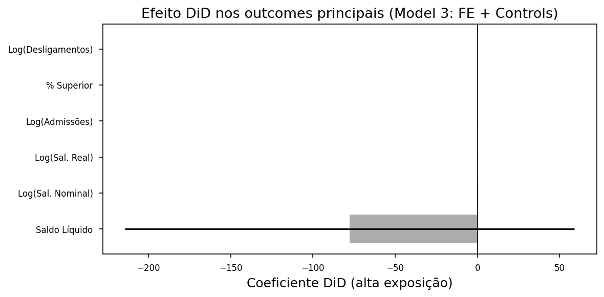
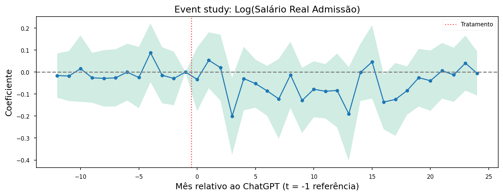
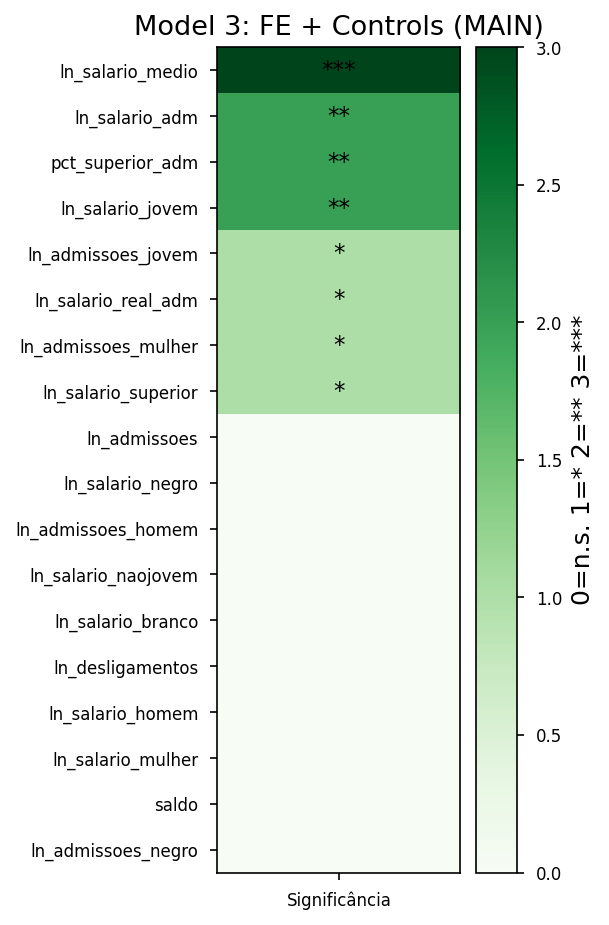

# ETAPA 2c — Resultados: Consolidação e Síntese da Análise DiD


**Dissertação:** Inteligência Artificial Generativa e o Mercado de
Trabalho Brasileiro: Uma Análise de Exposição Ocupacional e seus Efeitos
Distributivos.

**Aluno:** Manoel Brasil Orlandi

------------------------------------------------------------------------

### Objetivo deste notebook

Organizar as tabelas e figuras geradas no **Notebook 2b** (Análise DiD)
para leitura com a orientadora. Inclui: listagem e exibição de todos os
resultados e tabelas em `outputs/tables` e `outputs/figures`, gráficos
adicionais para ilustrar os achados, **resumo narrativo** e uma
**tabela-síntese de achados** com relevância estatística (***/**/*) e
destaque em cores para os achados mais relevantes.

**Input:** Arquivos gerados pelo notebook
`etapa_2b_analise_did_caged_ilo.ipynb` (pastas `outputs/tables` e
`outputs/figures`).

### 1. Configuração do ambiente

Importar bibliotecas, definir caminhos e estilo de gráficos. Caminhos
relativos ao diretório `notebook/`.

``` python
# Verificar dependências e instalar apenas o que faltar (rode esta célula primeiro)
import importlib.util
import subprocess
import sys

PACOTES = [
    ("pandas", "pandas"),
    ("numpy", "numpy"),
    ("matplotlib", "matplotlib"),
    ("seaborn", "seaborn"),
]

def ja_instalado(nome_import):
    return importlib.util.find_spec(nome_import) is not None

faltando = [pip for imp, pip in PACOTES if not ja_instalado(imp)]
if faltando:
    subprocess.check_call([sys.executable, "-m", "pip", "install", "-q"] + faltando)
    print("Instalado:", ", ".join(faltando))
else:
    print("Todas as dependências já estão instaladas.")
```

    Todas as dependências já estão instaladas.

``` python
# Etapa 2c — Configuração
import warnings
import pandas as pd
import numpy as np
import matplotlib.pyplot as plt
import seaborn as sns
from pathlib import Path
from IPython.display import display, Image

warnings.filterwarnings("ignore", category=FutureWarning)

OUTPUTS_TABLES = Path("../../outputs/tables")
OUTPUTS_FIGURES = Path("../../outputs/figures")
OUTPUTS_TABLES.mkdir(parents=True, exist_ok=True)
OUTPUTS_FIGURES.mkdir(parents=True, exist_ok=True)

pd.set_option("display.max_columns", 20)
pd.set_option("display.width", 120)
pd.set_option("display.float_format", lambda x: f"{x:.4f}")

plt.style.use("seaborn-v0_8-paper")
sns.set_palette("Set2")
plt.rcParams.update({"font.size": 11, "axes.titlesize": 13, "axes.labelsize": 12, "figure.dpi": 150})

print("Configuração carregada.")
```

    Configuração carregada.

### 2. Tabelas geradas no etapa_2b

As tabelas abaixo foram salvas em `outputs/tables` pelo notebook
etapa_2b. Exibimos cada uma para leitura.

#### 2.1 Balanceamento pré-tratamento

Médias das variáveis no período pré-tratamento: grupo de controle (baixa
exposição) vs. grupo de tratamento (alta exposição). *Diff. Normalizada*
e indicador de balanceamento (✓ ou ⚠️).

``` python
path = OUTPUTS_TABLES / "balance_table_pre.csv"
if path.exists():
    df = pd.read_csv(path)
    display(df)
else:
    print("Arquivo não encontrado:", path, "- Execute o notebook etapa_2b para gerar as tabelas.")
```

<div>
<style scoped>
    .dataframe tbody tr th:only-of-type {
        vertical-align: middle;
    }
&#10;    .dataframe tbody tr th {
        vertical-align: top;
    }
&#10;    .dataframe thead th {
        text-align: right;
    }
</style>

|     | Variável              | Controle  | Tratamento | Diff. Normalizada | Balanceado |
|-----|-----------------------|-----------|------------|-------------------|------------|
| 0   | Admissões (média)     | 2655.3378 | 3409.8367  | 0.0601            | ✓          |
| 1   | Desligamentos (média) | 2321.3264 | 2916.9194  | 0.0552            | ✓          |
| 2   | Saldo (média)         | 334.0114  | 492.9173   | 0.0865            | ✓          |
| 3   | Salário médio (R\$)   | 2738.7651 | 5388.2059  | 0.6846            | ⚠️         |
| 4   | Idade média           | 32.7528   | 31.7992    | -0.1723           | ✓          |
| 5   | % Mulheres            | 0.2789    | 0.4414     | 0.6965            | ⚠️         |
| 6   | % Superior            | 0.1557    | 0.4189     | 1.1501            | ⚠️         |
| 7   | Meses                 | 22.5706   | 21.8550    | -0.2187           | ✓          |

</div>

#### 2.2 Resultados principais DiD

Coeficiente do tratamento (alta exposição à IA) para cada modelo (1:
Basic, 2: FE, 3: FE + Controls — principal, 4–6: contínuo e 4d) e
outcome. Erros padrão clusterizados por ocupação (CBO 4d). Coluna
`stars`: \*\*\* p\<0.01, \*\* p\<0.05, \* p\<0.10.

``` python
path = OUTPUTS_TABLES / "did_main_results.csv"
if path.exists():
    df = pd.read_csv(path)
    display(df)
else:
    print("Arquivo não encontrado:", path)
```

<div>
<style scoped>
    .dataframe tbody tr th:only-of-type {
        vertical-align: middle;
    }
&#10;    .dataframe tbody tr th {
        vertical-align: top;
    }
&#10;    .dataframe thead th {
        text-align: right;
    }
</style>

|  | model | outcome | coef | se | p_value | stars | n_obs | n_clusters |
|----|----|----|----|----|----|----|----|----|
| 0 | Model 1: Basic | ln_admissoes | 0.0056 | 0.0375 | 0.8807 | NaN | 32988 | NaN |
| 1 | Model 2: FE | ln_admissoes | -0.0215 | 0.0268 | 0.4235 | NaN | 32988 | NaN |
| 2 | Model 3: FE + Controls (MAIN) | ln_admissoes | -0.0271 | 0.0264 | 0.3046 | NaN | 32988 | NaN |
| 3 | Model 4: Continuous (2d) | ln_admissoes | 0.0090 | 0.0804 | 0.9112 | NaN | 32988 | NaN |
| 4 | Model 5: FE + Controls (4d) | ln_admissoes | -0.0247 | 0.0266 | 0.3528 | NaN | 32988 | NaN |
| ... | ... | ... | ... | ... | ... | ... | ... | ... |
| 103 | Model 2: FE | ln_admissoes_negro | -0.0032 | 0.0274 | 0.9076 | NaN | 32988 | NaN |
| 104 | Model 3: FE + Controls (MAIN) | ln_admissoes_negro | -0.0032 | 0.0272 | 0.9067 | NaN | 32988 | NaN |
| 105 | Model 4: Continuous (2d) | ln_admissoes_negro | 0.0880 | 0.0843 | 0.2970 | NaN | 32988 | NaN |
| 106 | Model 5: FE + Controls (4d) | ln_admissoes_negro | -0.0132 | 0.0282 | 0.6404 | NaN | 32988 | NaN |
| 107 | Model 6: Continuous (4d) | ln_admissoes_negro | 0.0439 | 0.0831 | 0.5978 | NaN | 32988 | NaN |

<p>108 rows × 8 columns</p>
</div>

#### 2.3 Testes de robustez

Efeito DiD sob: cutoff alternativo (top 10%, 25%, mediana), placebo
(tratamento em 12/2021), exclusão de ocupações de TI, tendências
diferenciais (pré) e crosswalk 4d.

``` python
path = OUTPUTS_TABLES / "robustness_results.csv"
if path.exists():
    df = pd.read_csv(path)
    display(df)
else:
    print("Arquivo não encontrado:", path)
```

<div>
<style scoped>
    .dataframe tbody tr th:only-of-type {
        vertical-align: middle;
    }
&#10;    .dataframe tbody tr th {
        vertical-align: top;
    }
&#10;    .dataframe thead th {
        text-align: right;
    }
</style>

|  | outcome | test_type | specification | coef | se | p_value | stars |
|----|----|----|----|----|----|----|----|
| 0 | ln_admissoes | Alternative Cutoff | Top 20% (MAIN) | -0.0266 | 0.0265 | 0.3166 | NaN |
| 1 | ln_desligamentos | Alternative Cutoff | Top 20% (MAIN) | 0.0190 | 0.0268 | 0.4786 | NaN |
| 2 | saldo | Alternative Cutoff | Top 20% (MAIN) | -77.6159 | 69.6389 | 0.2655 | NaN |
| 3 | ln_salario_adm | Alternative Cutoff | Top 20% (MAIN) | -0.0631 | 0.0285 | 0.0274 | \*\* |
| 4 | ln_admissoes | Alternative Cutoff | Top 10% | 0.0547 | 0.0345 | 0.1133 | NaN |
| 5 | ln_desligamentos | Alternative Cutoff | Top 10% | 0.0633 | 0.0380 | 0.0958 | \* |
| 6 | saldo | Alternative Cutoff | Top 10% | -173.8931 | 102.5733 | 0.0905 | \* |
| 7 | ln_salario_adm | Alternative Cutoff | Top 10% | -0.0438 | 0.0372 | 0.2392 | NaN |
| 8 | ln_admissoes | Alternative Cutoff | Top 25% | -0.0369 | 0.0239 | 0.1241 | NaN |
| 9 | ln_desligamentos | Alternative Cutoff | Top 25% | 0.0297 | 0.0250 | 0.2351 | NaN |
| 10 | saldo | Alternative Cutoff | Top 25% | -112.5864 | 63.4546 | 0.0765 | \* |
| 11 | ln_salario_adm | Alternative Cutoff | Top 25% | -0.0630 | 0.0254 | 0.0135 | \*\* |
| 12 | ln_admissoes | Alternative Cutoff | Mediana | -0.0107 | 0.0196 | 0.5865 | NaN |
| 13 | ln_desligamentos | Alternative Cutoff | Mediana | -0.0112 | 0.0203 | 0.5811 | NaN |
| 14 | saldo | Alternative Cutoff | Mediana | -32.3607 | 48.2539 | 0.5027 | NaN |
| 15 | ln_salario_adm | Alternative Cutoff | Mediana | -0.0132 | 0.0211 | 0.5327 | NaN |
| 16 | ln_admissoes | Placebo | Placebo (12/2021) | 0.0000 | 0.0232 | 0.9986 | NaN |
| 17 | ln_desligamentos | Placebo | Placebo (12/2021) | 0.0151 | 0.0211 | 0.4739 | NaN |
| 18 | saldo | Placebo | Placebo (12/2021) | -113.1696 | 114.5243 | 0.3235 | NaN |
| 19 | ln_salario_adm | Placebo | Placebo (12/2021) | 0.0105 | 0.0321 | 0.7448 | NaN |
| 20 | ln_admissoes | Excl. TI | Sem ocupações TI | -0.0241 | 0.0306 | 0.4314 | NaN |
| 21 | ln_desligamentos | Excl. TI | Sem ocupações TI | 0.0317 | 0.0310 | 0.3065 | NaN |
| 22 | saldo | Excl. TI | Sem ocupações TI | -92.5477 | 79.3140 | 0.2437 | NaN |
| 23 | ln_salario_adm | Excl. TI | Sem ocupações TI | -0.0767 | 0.0324 | 0.0181 | \*\* |
| 24 | ln_admissoes | Differential Trends | Trend × Tratamento (pré) | 0.0007 | 0.0020 | 0.7343 | NaN |
| 25 | ln_desligamentos | Differential Trends | Trend × Tratamento (pré) | 0.0007 | 0.0016 | 0.6740 | NaN |
| 26 | saldo | Differential Trends | Trend × Tratamento (pré) | -0.0890 | 8.0470 | 0.9912 | NaN |
| 27 | ln_salario_adm | Differential Trends | Trend × Tratamento (pré) | -0.0001 | 0.0024 | 0.9805 | NaN |
| 28 | ln_admissoes | Crosswalk 4d | Score 4d (fallback hierárquico 6 níveis) | -0.0238 | 0.0268 | 0.3743 | NaN |
| 29 | ln_desligamentos | Crosswalk 4d | Score 4d (fallback hierárquico 6 níveis) | 0.0197 | 0.0264 | 0.4555 | NaN |
| 30 | saldo | Crosswalk 4d | Score 4d (fallback hierárquico 6 níveis) | -142.3377 | 73.4753 | 0.0532 | \* |
| 31 | ln_salario_adm | Crosswalk 4d | Score 4d (fallback hierárquico 6 níveis) | -0.0635 | 0.0283 | 0.0252 | \*\* |

</div>

#### 2.4 Robustez: cluster por CBO 2d

Resultado do modelo principal (FE + Controls) com erros padrão
clusterizados por CBO 2 dígitos em vez de 4d.

``` python
path = OUTPUTS_TABLES / "did_robustez_cbo2d.csv"
if path.exists():
    df = pd.read_csv(path)
    display(df)
else:
    print("Arquivo não encontrado:", path)
```

<div>
<style scoped>
    .dataframe tbody tr th:only-of-type {
        vertical-align: middle;
    }
&#10;    .dataframe tbody tr th {
        vertical-align: top;
    }
&#10;    .dataframe thead th {
        text-align: right;
    }
</style>

|  | model | outcome | coef | se | p_value | stars | n_obs | n_clusters | vcov |
|----|----|----|----|----|----|----|----|----|----|
| 0 | FE+Controls (cluster cbo_2d) | ln_salario_adm | -0.0631 | 0.0364 | 0.0896 | \* | 32988 | NaN | cbo_2d |

</div>

#### 2.5 Teste de tendências paralelas

Para cada outcome: número de coeficientes pré-tratamento no event study,
quantos significativos (p\<0.05), p-valor do teste conjunto (pré = 0) e
status (PARALELAS ou PREOCUPAÇÃO).

``` python
path = OUTPUTS_TABLES / "parallel_trends_test.csv"
if path.exists():
    df = pd.read_csv(path)
    display(df)
else:
    print("Arquivo não encontrado:", path)
```

<div>
<style scoped>
    .dataframe tbody tr th:only-of-type {
        vertical-align: middle;
    }
&#10;    .dataframe tbody tr th {
        vertical-align: top;
    }
&#10;    .dataframe thead th {
        text-align: right;
    }
</style>

|  | Outcome | N coefs pré | Sig. (p\<0.05) | p-valor conjunto | Status |
|----|----|----|----|----|----|
| 0 | Log(Admissões) | 11 | 0 | 0.6390 | PARALELAS |
| 1 | Log(Desligamentos) | 11 | 5 | 0.0000 | PREOCUPAÇÃO |
| 2 | Saldo Líquido | 11 | 0 | 0.3960 | PARALELAS |
| 3 | Log(Salário Admissão Nominal) | 11 | 0 | 0.9850 | PARALELAS |
| 4 | Log(Salário Real Admissão) | 11 | 0 | 0.9930 | PARALELAS |
| 5 | % Superior (Admissão) | 11 | 0 | 0.9960 | PARALELAS |
| 6 | Log(Salário Mulheres) | 11 | 0 | 0.0730 | PREOCUPAÇÃO |
| 7 | Log(Salário Homens) | 11 | 0 | 0.9580 | PARALELAS |
| 8 | Log(Salário Jovens) | 11 | 0 | 0.2650 | PARALELAS |
| 9 | Log(Salário Não-Jovens) | 11 | 0 | 0.6960 | PARALELAS |
| 10 | Log(Salário Brancos) | 11 | 0 | 0.5160 | PARALELAS |
| 11 | Log(Salário Negros) | 11 | 0 | 0.9830 | PARALELAS |
| 12 | Log(Salário Superior) | 11 | 0 | 0.6570 | PARALELAS |
| 13 | Log(Salário Médio) | 11 | 0 | 0.8250 | PARALELAS |
| 14 | Log(Admissões Mulheres) | 11 | 0 | 0.8530 | PARALELAS |
| 15 | Log(Admissões Homens) | 11 | 0 | 0.8840 | PARALELAS |
| 16 | Log(Admissões Jovens) | 11 | 0 | 0.6960 | PARALELAS |
| 17 | Log(Admissões Negros) | 11 | 0 | 0.8940 | PARALELAS |

</div>

#### 2.6 Heterogeneidade (Triple DiD)

Efeito principal e interação (tratamento × grupo: jovem, feminino,
superior, negro) para cada outcome. `interaction_pval` indica se o
efeito difere entre grupos.

``` python
path = OUTPUTS_TABLES / "heterogeneity_triple_did.csv"
if path.exists():
    df = pd.read_csv(path)
    display(df)
else:
    print("Arquivo não encontrado:", path)
```

<div>
<style scoped>
    .dataframe tbody tr th:only-of-type {
        vertical-align: middle;
    }
&#10;    .dataframe tbody tr th {
        vertical-align: top;
    }
&#10;    .dataframe thead th {
        text-align: right;
    }
</style>

|  | outcome | outcome_label | group | main_effect | interaction | interaction_pval |
|----|----|----|----|----|----|----|
| 0 | ln_admissoes | Log(Admissões) | Idade (jovem ≤30) | -0.0444 | 0.0866 | 0.1545 |
| 1 | ln_desligamentos | Log(Desligamentos) | Idade (jovem ≤30) | 0.0075 | 0.0682 | 0.3731 |
| 2 | saldo | Saldo Líquido | Idade (jovem ≤30) | -7.9403 | -356.7984 | 0.2073 |
| 3 | ln_salario_adm | Log(Salário Admissão Nominal) | Idade (jovem ≤30) | -0.0055 | -0.3235 | 0.0007 |
| 4 | ln_salario_real_adm | Log(Salário Real Admissão) | Idade (jovem ≤30) | -0.0000 | -0.1863 | 0.0025 |
| 5 | pct_superior_adm | % Superior (Admissão) | Idade (jovem ≤30) | 0.0138 | -0.0205 | 0.0656 |
| 6 | ln_salario_mulher | Log(Salário Mulheres) | Idade (jovem ≤30) | -0.0455 | 0.0066 | 0.9369 |
| 7 | ln_salario_homem | Log(Salário Homens) | Idade (jovem ≤30) | 0.0478 | -0.2393 | 0.0125 |
| 8 | ln_salario_jovem | Log(Salário Jovens) | Idade (jovem ≤30) | -0.1268 | 0.0085 | 0.9368 |
| 9 | ln_salario_naojovem | Log(Salário Não-Jovens) | Idade (jovem ≤30) | -0.0350 | 0.1236 | 0.1860 |
| 10 | ln_salario_branco | Log(Salário Brancos) | Idade (jovem ≤30) | -0.0000 | -0.1428 | 0.0965 |
| 11 | ln_salario_negro | Log(Salário Negros) | Idade (jovem ≤30) | 0.1878 | -0.3994 | 0.0024 |
| 12 | ln_salario_superior | Log(Salário Superior) | Idade (jovem ≤30) | -0.1076 | 0.1452 | 0.0899 |
| 13 | ln_salario_medio | Log(Salário Médio) | Idade (jovem ≤30) | -0.0453 | -0.2012 | 0.0223 |
| 14 | ln_admissoes_mulher | Log(Admissões Mulheres) | Idade (jovem ≤30) | -0.0700 | 0.1158 | 0.0510 |
| 15 | ln_admissoes_homem | Log(Admissões Homens) | Idade (jovem ≤30) | -0.0519 | 0.0864 | 0.1436 |
| 16 | ln_admissoes_jovem | Log(Admissões Jovens) | Idade (jovem ≤30) | -0.0689 | 0.0633 | 0.3207 |
| 17 | ln_admissoes_negro | Log(Admissões Negros) | Idade (jovem ≤30) | -0.0039 | 0.0034 | 0.9608 |
| 18 | ln_admissoes | Log(Admissões) | Gênero (feminino) | -0.0371 | 0.0035 | 0.9446 |
| 19 | ln_desligamentos | Log(Desligamentos) | Gênero (feminino) | -0.0330 | 0.0631 | 0.1702 |
| 20 | saldo | Saldo Líquido | Gênero (feminino) | 32.6662 | -130.4921 | 0.3813 |
| 21 | ln_salario_adm | Log(Salário Admissão Nominal) | Gênero (feminino) | -0.1190 | 0.0848 | 0.1922 |
| 22 | ln_salario_real_adm | Log(Salário Real Admissão) | Gênero (feminino) | -0.0593 | 0.0442 | 0.3049 |
| 23 | pct_superior_adm | % Superior (Admissão) | Gênero (feminino) | 0.0224 | -0.0132 | 0.1287 |
| 24 | ln_salario_mulher | Log(Salário Mulheres) | Gênero (feminino) | -0.1170 | 0.1389 | 0.1594 |
| 25 | ln_salario_homem | Log(Salário Homens) | Gênero (feminino) | 0.0229 | -0.1008 | 0.0847 |
| 26 | ln_salario_jovem | Log(Salário Jovens) | Gênero (feminino) | -0.3424 | 0.2747 | 0.0352 |
| 27 | ln_salario_naojovem | Log(Salário Não-Jovens) | Gênero (feminino) | -0.0327 | 0.0277 | 0.7390 |
| 28 | ln_salario_branco | Log(Salário Brancos) | Gênero (feminino) | 0.0378 | -0.0998 | 0.1519 |
| 29 | ln_salario_negro | Log(Salário Negros) | Gênero (feminino) | 0.2306 | -0.1629 | 0.2725 |
| 30 | ln_salario_superior | Log(Salário Superior) | Gênero (feminino) | -0.1068 | 0.0323 | 0.6857 |
| 31 | ln_salario_medio | Log(Salário Médio) | Gênero (feminino) | -0.1471 | 0.0827 | 0.2584 |
| 32 | ln_admissoes_mulher | Log(Admissões Mulheres) | Gênero (feminino) | -0.0449 | -0.0135 | 0.8036 |
| 33 | ln_admissoes_homem | Log(Admissões Homens) | Gênero (feminino) | -0.0381 | -0.0066 | 0.8967 |
| 34 | ln_admissoes_jovem | Log(Admissões Jovens) | Gênero (feminino) | -0.0709 | 0.0173 | 0.7614 |
| 35 | ln_admissoes_negro | Log(Admissões Negros) | Gênero (feminino) | -0.0456 | 0.0456 | 0.3979 |
| 36 | ln_admissoes | Log(Admissões) | Educação (superior) | 0.0875 | -0.1462 | 0.0500 |
| 37 | ln_desligamentos | Log(Desligamentos) | Educação (superior) | -0.0037 | -0.0011 | 0.9875 |
| 38 | saldo | Saldo Líquido | Educação (superior) | 32.0870 | -148.4784 | 0.3556 |
| 39 | ln_salario_adm | Log(Salário Admissão Nominal) | Educação (superior) | -0.1050 | 0.0306 | 0.7787 |
| 40 | ln_salario_real_adm | Log(Salário Real Admissão) | Educação (superior) | -0.0546 | 0.0124 | 0.8555 |
| 41 | pct_superior_adm | % Superior (Admissão) | Educação (superior) | 0.0333 | -0.0476 | 0.0010 |
| 42 | ln_salario_mulher | Log(Salário Mulheres) | Educação (superior) | -0.0526 | -0.0763 | 0.4951 |
| 43 | ln_salario_homem | Log(Salário Homens) | Educação (superior) | 0.0542 | -0.1078 | 0.2799 |
| 44 | ln_salario_jovem | Log(Salário Jovens) | Educação (superior) | -0.0340 | -0.1732 | 0.2806 |
| 45 | ln_salario_naojovem | Log(Salário Não-Jovens) | Educação (superior) | 0.0811 | -0.1314 | 0.2486 |
| 46 | ln_salario_branco | Log(Salário Brancos) | Educação (superior) | -0.0689 | -0.0198 | 0.8924 |
| 47 | ln_salario_negro | Log(Salário Negros) | Educação (superior) | 0.0070 | 0.0523 | 0.6952 |
| 48 | ln_salario_superior | Log(Salário Superior) | Educação (superior) | 0.2279 | -0.6412 | 0.0000 |
| 49 | ln_salario_medio | Log(Salário Médio) | Educação (superior) | -0.0629 | -0.0900 | 0.2653 |
| 50 | ln_admissoes_mulher | Log(Admissões Mulheres) | Educação (superior) | 0.0389 | -0.1008 | 0.2335 |
| 51 | ln_admissoes_homem | Log(Admissões Homens) | Educação (superior) | 0.0684 | -0.1295 | 0.0865 |
| 52 | ln_admissoes_jovem | Log(Admissões Jovens) | Educação (superior) | 0.0740 | -0.1484 | 0.0624 |
| 53 | ln_admissoes_negro | Log(Admissões Negros) | Educação (superior) | 0.0955 | -0.1261 | 0.0745 |

</div>

#### 2.7 Event study (coeficientes por período relativo)

Coeficientes do evento (mês relativo ao lançamento do ChatGPT, t = -1 é
referência). Abaixo: outcomes principais. Arquivos completos em
`outputs/tables/event_study_*.csv`.

``` python
event_study_files = sorted(OUTPUTS_TABLES.glob("event_study_*.csv"))
print("Arquivos event study disponíveis:", [f.name for f in event_study_files])

# Exibir resumo para outcomes principais
principais = ["ln_admissoes", "ln_desligamentos", "saldo", "ln_salario_adm", "ln_salario_real_adm", "ln_salario_jovem"]
for out in principais:
    path = OUTPUTS_TABLES / f"event_study_{out}.csv"
    if path.exists():
        df_es = pd.read_csv(path)
        print(f"\n--- Event study: {out} ---")
        display(df_es.head(15))
```

    Arquivos event study disponíveis: ['event_study_ln_admissoes.csv', 'event_study_ln_admissoes_homem.csv', 'event_study_ln_admissoes_jovem.csv', 'event_study_ln_admissoes_mulher.csv', 'event_study_ln_admissoes_negro.csv', 'event_study_ln_desligamentos.csv', 'event_study_ln_salario_adm.csv', 'event_study_ln_salario_branco.csv', 'event_study_ln_salario_homem.csv', 'event_study_ln_salario_jovem.csv', 'event_study_ln_salario_medio.csv', 'event_study_ln_salario_mulher.csv', 'event_study_ln_salario_naojovem.csv', 'event_study_ln_salario_negro.csv', 'event_study_ln_salario_real_adm.csv', 'event_study_ln_salario_superior.csv', 'event_study_pct_superior_adm.csv', 'event_study_saldo.csv']

    --- Event study: ln_admissoes ---

<div>
<style scoped>
    .dataframe tbody tr th:only-of-type {
        vertical-align: middle;
    }
&#10;    .dataframe tbody tr th {
        vertical-align: top;
    }
&#10;    .dataframe thead th {
        text-align: right;
    }
</style>

|     | t   | coef    | se     | p_value | is_reference | is_pre | ci_low  | ci_high |
|-----|-----|---------|--------|---------|--------------|--------|---------|---------|
| 0   | -12 | -0.0038 | 0.0379 | 0.9195  | False        | True   | -0.0782 | 0.0705  |
| 1   | -11 | -0.0087 | 0.0453 | 0.8481  | False        | True   | -0.0974 | 0.0801  |
| 2   | -10 | -0.0429 | 0.0572 | 0.4536  | False        | True   | -0.1550 | 0.0692  |
| 3   | -9  | -0.0502 | 0.0470 | 0.2860  | False        | True   | -0.1425 | 0.0420  |
| 4   | -8  | -0.0075 | 0.0413 | 0.8559  | False        | True   | -0.0885 | 0.0735  |
| 5   | -7  | -0.0445 | 0.0416 | 0.2854  | False        | True   | -0.1259 | 0.0370  |
| 6   | -6  | -0.0433 | 0.0366 | 0.2375  | False        | True   | -0.1150 | 0.0285  |
| 7   | -5  | -0.0527 | 0.0353 | 0.1352  | False        | True   | -0.1219 | 0.0164  |
| 8   | -4  | -0.0594 | 0.0488 | 0.2243  | False        | True   | -0.1550 | 0.0363  |
| 9   | -3  | -0.0269 | 0.0375 | 0.4739  | False        | True   | -0.1003 | 0.0466  |
| 10  | -2  | -0.0169 | 0.0332 | 0.6102  | False        | True   | -0.0821 | 0.0482  |
| 11  | -1  | 0.0000  | 0.0000 | NaN     | True         | True   | 0.0000  | 0.0000  |
| 12  | 0   | 0.0778  | 0.0359 | 0.0307  | False        | False  | 0.0074  | 0.1483  |
| 13  | 1   | 0.0089  | 0.0390 | 0.8189  | False        | False  | -0.0675 | 0.0854  |
| 14  | 2   | -0.0990 | 0.0558 | 0.0763  | False        | False  | -0.2083 | 0.0103  |

</div>


    --- Event study: ln_desligamentos ---

<div>
<style scoped>
    .dataframe tbody tr th:only-of-type {
        vertical-align: middle;
    }
&#10;    .dataframe tbody tr th {
        vertical-align: top;
    }
&#10;    .dataframe thead th {
        text-align: right;
    }
</style>

|     | t   | coef    | se     | p_value | is_reference | is_pre | ci_low  | ci_high |
|-----|-----|---------|--------|---------|--------------|--------|---------|---------|
| 0   | -12 | 0.0392  | 0.0323 | 0.2254  | False        | True   | -0.0241 | 0.1024  |
| 1   | -11 | 0.0831  | 0.0349 | 0.0176  | False        | True   | 0.0147  | 0.1516  |
| 2   | -10 | 0.0369  | 0.0384 | 0.3367  | False        | True   | -0.0383 | 0.1122  |
| 3   | -9  | 0.0277  | 0.0336 | 0.4101  | False        | True   | -0.0382 | 0.0936  |
| 4   | -8  | 0.0756  | 0.0336 | 0.0250  | False        | True   | 0.0096  | 0.1415  |
| 5   | -7  | 0.1418  | 0.0337 | 0.0000  | False        | True   | 0.0756  | 0.2079  |
| 6   | -6  | 0.0813  | 0.0368 | 0.0276  | False        | True   | 0.0091  | 0.1535  |
| 7   | -5  | 0.0558  | 0.0378 | 0.1409  | False        | True   | -0.0184 | 0.1299  |
| 8   | -4  | 0.0301  | 0.0338 | 0.3732  | False        | True   | -0.0362 | 0.0964  |
| 9   | -3  | 0.0741  | 0.0326 | 0.0233  | False        | True   | 0.0102  | 0.1379  |
| 10  | -2  | 0.0546  | 0.0285 | 0.0557  | False        | True   | -0.0012 | 0.1104  |
| 11  | -1  | 0.0000  | 0.0000 | NaN     | True         | True   | 0.0000  | 0.0000  |
| 12  | 0   | -0.0199 | 0.0484 | 0.6814  | False        | False  | -0.1148 | 0.0750  |
| 13  | 1   | 0.0928  | 0.0354 | 0.0089  | False        | False  | 0.0235  | 0.1620  |
| 14  | 2   | 0.0618  | 0.0341 | 0.0705  | False        | False  | -0.0051 | 0.1287  |

</div>


    --- Event study: saldo ---

<div>
<style scoped>
    .dataframe tbody tr th:only-of-type {
        vertical-align: middle;
    }
&#10;    .dataframe tbody tr th {
        vertical-align: top;
    }
&#10;    .dataframe thead th {
        text-align: right;
    }
</style>

|     | t   | coef      | se       | p_value | is_reference | is_pre | ci_low     | ci_high  |
|-----|-----|-----------|----------|---------|--------------|--------|------------|----------|
| 0   | -12 | -194.3597 | 266.2103 | 0.4656  | False        | True   | -716.1319  | 327.4125 |
| 1   | -11 | -349.4580 | 428.8335 | 0.4154  | False        | True   | -1189.9717 | 491.0557 |
| 2   | -10 | -193.2848 | 399.0517 | 0.6283  | False        | True   | -975.4261  | 588.8565 |
| 3   | -9  | -238.6669 | 337.6622 | 0.4799  | False        | True   | -900.4847  | 423.1510 |
| 4   | -8  | -269.3918 | 307.8041 | 0.3818  | False        | True   | -872.6878  | 333.9042 |
| 5   | -7  | -383.5216 | 260.0247 | 0.1407  | False        | True   | -893.1701  | 126.1268 |
| 6   | -6  | -301.7401 | 246.3585 | 0.2211  | False        | True   | -784.6027  | 181.1226 |
| 7   | -5  | -439.4320 | 273.1858 | 0.1082  | False        | True   | -974.8762  | 96.0121  |
| 8   | -4  | -321.2117 | 301.2095 | 0.2866  | False        | True   | -911.5823  | 269.1589 |
| 9   | -3  | -252.9877 | 258.9379 | 0.3289  | False        | True   | -760.5061  | 254.5306 |
| 10  | -2  | -126.9799 | 173.7076 | 0.4651  | False        | True   | -467.4468  | 213.4870 |
| 11  | -1  | 0.0000    | 0.0000   | NaN     | True         | True   | 0.0000     | 0.0000   |
| 12  | 0   | -587.3553 | 502.3584 | 0.2428  | False        | False  | -1571.9779 | 397.2673 |
| 13  | 1   | -442.1441 | 409.7918 | 0.2810  | False        | False  | -1245.3360 | 361.0479 |
| 14  | 2   | -291.8871 | 367.1464 | 0.4269  | False        | False  | -1011.4941 | 427.7198 |

</div>


    --- Event study: ln_salario_adm ---

<div>
<style scoped>
    .dataframe tbody tr th:only-of-type {
        vertical-align: middle;
    }
&#10;    .dataframe tbody tr th {
        vertical-align: top;
    }
&#10;    .dataframe thead th {
        text-align: right;
    }
</style>

|     | t   | coef    | se     | p_value | is_reference | is_pre | ci_low  | ci_high |
|-----|-----|---------|--------|---------|--------------|--------|---------|---------|
| 0   | -12 | 0.0123  | 0.0761 | 0.8720  | False        | True   | -0.1369 | 0.1614  |
| 1   | -11 | 0.0106  | 0.0824 | 0.8979  | False        | True   | -0.1509 | 0.1721  |
| 2   | -10 | 0.0651  | 0.1076 | 0.5458  | False        | True   | -0.1459 | 0.2760  |
| 3   | -9  | -0.0083 | 0.0839 | 0.9211  | False        | True   | -0.1728 | 0.1562  |
| 4   | -8  | -0.0567 | 0.0968 | 0.5579  | False        | True   | -0.2464 | 0.1329  |
| 5   | -7  | -0.0418 | 0.0977 | 0.6687  | False        | True   | -0.2334 | 0.1497  |
| 6   | -6  | 0.0376  | 0.0975 | 0.6996  | False        | True   | -0.1535 | 0.2288  |
| 7   | -5  | -0.0402 | 0.1043 | 0.7003  | False        | True   | -0.2446 | 0.1643  |
| 8   | -4  | 0.1292  | 0.0980 | 0.1878  | False        | True   | -0.0629 | 0.3213  |
| 9   | -3  | -0.0194 | 0.0925 | 0.8337  | False        | True   | -0.2007 | 0.1619  |
| 10  | -2  | -0.0549 | 0.0956 | 0.5658  | False        | True   | -0.2424 | 0.1325  |
| 11  | -1  | 0.0000  | 0.0000 | NaN     | True         | True   | 0.0000  | 0.0000  |
| 12  | 0   | 0.0012  | 0.1054 | 0.9911  | False        | False  | -0.2053 | 0.2077  |
| 13  | 1   | 0.0809  | 0.0864 | 0.3492  | False        | False  | -0.0884 | 0.2503  |
| 14  | 2   | 0.0257  | 0.0984 | 0.7940  | False        | False  | -0.1671 | 0.2185  |

</div>


    --- Event study: ln_salario_real_adm ---

<div>
<style scoped>
    .dataframe tbody tr th:only-of-type {
        vertical-align: middle;
    }
&#10;    .dataframe tbody tr th {
        vertical-align: top;
    }
&#10;    .dataframe thead th {
        text-align: right;
    }
</style>

|     | t   | coef    | se     | p_value | is_reference | is_pre | ci_low  | ci_high |
|-----|-----|---------|--------|---------|--------------|--------|---------|---------|
| 0   | -12 | -0.0156 | 0.0514 | 0.7614  | False        | True   | -0.1164 | 0.0852  |
| 1   | -11 | -0.0180 | 0.0580 | 0.7558  | False        | True   | -0.1316 | 0.0956  |
| 2   | -10 | 0.0157  | 0.0770 | 0.8382  | False        | True   | -0.1351 | 0.1666  |
| 3   | -9  | -0.0259 | 0.0578 | 0.6541  | False        | True   | -0.1393 | 0.0874  |
| 4   | -8  | -0.0285 | 0.0654 | 0.6633  | False        | True   | -0.1567 | 0.0997  |
| 5   | -7  | -0.0262 | 0.0663 | 0.6926  | False        | True   | -0.1562 | 0.1038  |
| 6   | -6  | -0.0001 | 0.0660 | 0.9982  | False        | True   | -0.1294 | 0.1291  |
| 7   | -5  | -0.0248 | 0.0710 | 0.7266  | False        | True   | -0.1640 | 0.1143  |
| 8   | -4  | 0.0878  | 0.0682 | 0.1981  | False        | True   | -0.0458 | 0.2214  |
| 9   | -3  | -0.0144 | 0.0651 | 0.8249  | False        | True   | -0.1421 | 0.1132  |
| 10  | -2  | -0.0289 | 0.0622 | 0.6429  | False        | True   | -0.1508 | 0.0931  |
| 11  | -1  | 0.0000  | 0.0000 | NaN     | True         | True   | 0.0000  | 0.0000  |
| 12  | 0   | -0.0330 | 0.0737 | 0.6548  | False        | False  | -0.1774 | 0.1114  |
| 13  | 1   | 0.0540  | 0.0647 | 0.4046  | False        | False  | -0.0729 | 0.1809  |
| 14  | 2   | 0.0201  | 0.0765 | 0.7929  | False        | False  | -0.1299 | 0.1701  |

</div>


    --- Event study: ln_salario_jovem ---

<div>
<style scoped>
    .dataframe tbody tr th:only-of-type {
        vertical-align: middle;
    }
&#10;    .dataframe tbody tr th {
        vertical-align: top;
    }
&#10;    .dataframe thead th {
        text-align: right;
    }
</style>

|     | t   | coef    | se     | p_value | is_reference | is_pre | ci_low  | ci_high |
|-----|-----|---------|--------|---------|--------------|--------|---------|---------|
| 0   | -12 | 0.2473  | 0.1603 | 0.1235  | False        | True   | -0.0669 | 0.5616  |
| 1   | -11 | 0.1104  | 0.1531 | 0.4712  | False        | True   | -0.1896 | 0.4104  |
| 2   | -10 | 0.2639  | 0.1710 | 0.1233  | False        | True   | -0.0713 | 0.5990  |
| 3   | -9  | 0.0516  | 0.1552 | 0.7398  | False        | True   | -0.2526 | 0.3558  |
| 4   | -8  | 0.1100  | 0.1897 | 0.5622  | False        | True   | -0.2618 | 0.4818  |
| 5   | -7  | 0.0971  | 0.2055 | 0.6366  | False        | True   | -0.3056 | 0.4999  |
| 6   | -6  | 0.2559  | 0.1939 | 0.1873  | False        | True   | -0.1240 | 0.6359  |
| 7   | -5  | 0.2109  | 0.1664 | 0.2054  | False        | True   | -0.1152 | 0.5369  |
| 8   | -4  | 0.3670  | 0.1889 | 0.0526  | False        | True   | -0.0034 | 0.7373  |
| 9   | -3  | 0.0886  | 0.1847 | 0.6314  | False        | True   | -0.2734 | 0.4506  |
| 10  | -2  | 0.0725  | 0.1911 | 0.7047  | False        | True   | -0.3021 | 0.4470  |
| 11  | -1  | 0.0000  | 0.0000 | NaN     | True         | True   | 0.0000  | 0.0000  |
| 12  | 0   | -0.0847 | 0.2158 | 0.6947  | False        | False  | -0.5077 | 0.3382  |
| 13  | 1   | 0.1373  | 0.2224 | 0.5374  | False        | False  | -0.2987 | 0.5732  |
| 14  | 2   | 0.2700  | 0.2055 | 0.1894  | False        | False  | -0.1328 | 0.6728  |

</div>

### 3. Figuras geradas no etapa_2b

Figuras salvas em `outputs/figures` pelo notebook etapa_2b (tendências
paralelas, event study agregado, scatter exposição vs coeficiente). Se a
pasta estiver vazia, execute o notebook etapa_2b para gerá-las.

``` python
figuras = sorted(OUTPUTS_FIGURES.glob("*.png")) + sorted(OUTPUTS_FIGURES.glob("*.pdf"))
if not figuras:
    print("Nenhuma figura encontrada em", OUTPUTS_FIGURES)
    print("Execute o notebook etapa_2b_analise_did_caged_ilo.ipynb para gerar as figuras.")
else:
    for path in figuras:
        print("---", path.name, "---")
        if path.suffix.lower() == ".png":
            display(Image(filename=str(path)))
        else:
            print("(PDF: abra manualmente ou use outro viewer)")
```

    --- event_study_all_outcomes.png ---


    --- parallel_trends_all_outcomes.png ---


    --- scatter_automation_index_vs_did_coef.png ---


### 4. Gráficos para ilustrar os achados

Gráficos construídos neste notebook a partir das tabelas do etapa_2b:
efeito DiD nos outcomes principais (Model 3) e dinâmica do event study
para um outcome emblemático.

#### 4.1 Efeito DiD (alta exposição à IA) nos outcomes principais

Coeficiente do tratamento para o modelo principal (Model 3: FE +
Controls). Barras: intervalo de confiança 95%. Cores: verde = p\<0.01,
laranja = p\<0.05, cinza = não significativo.

``` python
path = OUTPUTS_TABLES / "did_main_results.csv"
if not path.exists():
    print("Arquivo não encontrado. Execute o etapa_2b.")
else:
    df = pd.read_csv(path)
    main = df[df["model"] == "Model 3: FE + Controls (MAIN)"].copy()
    outcomes_principais = ["ln_admissoes", "ln_desligamentos", "saldo", "ln_salario_adm", "ln_salario_real_adm", "pct_superior_adm"]
    main = main[main["outcome"].isin(outcomes_principais)]
    labels = {
        "ln_admissoes": "Log(Admissões)", "ln_desligamentos": "Log(Desligamentos)", "saldo": "Saldo Líquido",
        "ln_salario_adm": "Log(Sal. Nominal)", "ln_salario_real_adm": "Log(Sal. Real)", "pct_superior_adm": "% Superior"
    }
    main["label"] = main["outcome"].map(labels)
    main["ci_lo"] = main["coef"] - 1.96 * main["se"]
    main["ci_hi"] = main["coef"] + 1.96 * main["se"]
    main["cor"] = main["p_value"].apply(lambda p: "#2e7d32" if p < 0.01 else "#ef6c00" if p < 0.05 else "#9e9e9e")
    main = main.sort_values("coef", ascending=True)
    fig, ax = plt.subplots(figsize=(8, 4))
    y_pos = range(len(main))
    ax.barh(y_pos, main["coef"], color=main["cor"], alpha=0.85)
    ax.errorbar(main["coef"], y_pos, xerr=1.96 * main["se"], fmt="none", color="black", capsize=3)
    ax.axvline(0, color="black", linewidth=0.8)
    ax.set_yticks(y_pos)
    ax.set_yticklabels(main["label"])
    ax.set_xlabel("Coeficiente DiD (alta exposição)")
    ax.set_title("Efeito DiD nos outcomes principais (Model 3: FE + Controls)")
    plt.tight_layout()
    plt.show()
```



#### 4.2 Dinâmica do efeito: Event study (salário real de admissão)

Coeficientes por mês relativo ao lançamento do ChatGPT (t = -1 é
referência). Banda: IC 95%. Permite verificar tendências pré e evolução
pós-tratamento.

``` python
path = OUTPUTS_TABLES / "event_study_ln_salario_real_adm.csv"
if not path.exists():
    path = OUTPUTS_TABLES / "event_study_ln_salario_jovem.csv"
if path.exists():
    df_es = pd.read_csv(path)
    df_es = df_es.sort_values("t")
    fig, ax = plt.subplots(figsize=(10, 4))
    ax.plot(df_es["t"], df_es["coef"], marker="o", markersize=5, color="#1f77b4")
    ax.fill_between(df_es["t"], df_es["ci_low"], df_es["ci_high"], alpha=0.3)
    ax.axhline(0, color="gray", linestyle="--")
    ax.axvline(-0.5, color="red", linestyle=":", alpha=0.7, label="Tratamento")
    ax.set_xlabel("Mês relativo ao ChatGPT (t = -1 referência)")
    ax.set_ylabel("Coeficiente")
    ax.set_title("Event study: " + ("Log(Salário Real Admissão)" if "real" in path.name else "Log(Salário Jovens)"))
    ax.legend()
    plt.tight_layout()
    plt.show()
else:
    print("Nenhum event_study_*.csv encontrado. Execute o etapa_2b.")
```



#### 4.3 Tabela visual de significância (outcomes principais × modelo principal)

Heatmap: célula escura = significativo (***/**/*), clara = não
significativo. Facilita ver onde os efeitos são robustos.

``` python
path = OUTPUTS_TABLES / "did_main_results.csv"
if path.exists():
    df = pd.read_csv(path)
    main3 = df[df["model"] == "Model 3: FE + Controls (MAIN)"].copy()
    main3["sig"] = main3["p_value"].apply(lambda p: 3 if p < 0.01 else 2 if p < 0.05 else 1 if p < 0.10 else 0)
    pivot = main3.set_index("outcome")["sig"].to_frame("estrelas")
    pivot = pivot.sort_values("estrelas", ascending=False)
    fig, ax = plt.subplots(figsize=(4, max(5, len(pivot) * 0.35)))
    cmap = plt.cm.Greens
    im = ax.imshow(pivot.values, cmap=cmap, vmin=0, vmax=3, aspect="auto")
    ax.set_yticks(range(len(pivot)))
    ax.set_yticklabels(pivot.index)
    ax.set_xticks([0])
    ax.set_xticklabels(["Significância"])
    for i in range(len(pivot)):
        ax.text(0, i, "***" if pivot.iloc[i, 0] == 3 else "**" if pivot.iloc[i, 0] == 2 else "*" if pivot.iloc[i, 0] == 1 else "", ha="center", va="center")
    plt.colorbar(im, ax=ax, label="0=n.s. 1=* 2=** 3=***")
    ax.set_title("Model 3: FE + Controls (MAIN)")
    plt.tight_layout()
    plt.show()
else:
    print("Arquivo não encontrado.")
```



### 5. Resumo dos achados

**Tendências paralelas:** O teste de tendências paralelas (coeficientes
pré-tratamento do event study) indica que a maioria dos outcomes
apresenta tendências paralelas entre grupos de alta e baixa exposição no
período pré-ChatGPT. Há sinal de preocupação em **Log(Desligamentos)** e
**Log(Salário Mulheres)** (p-valor conjunto pré baixo ou coeficientes
pré significativos), o que deve ser considerado na interpretação.

**Efeitos principais (Model 3: FE + Controls):** Após o lançamento do
ChatGPT, ocupações com **alta exposição à IA** apresentam, em média: (i)
**redução no salário de admissão nominal** (coef. negativo, **); (ii)
**redução no salário real de admissão\*\* (*); (iii) **aumento na
proporção de admissões com ensino superior** (**); (iv) **redução no
salário de admissão dos jovens** (**) e **redução no salário médio**
(***). Não há efeito estatisticamente significativo em admissões ou
desligamentos em nível; o saldo líquido é negativo em algumas
especificações (ex. contínuo 4d) com \* ou **.

**Robustez:** Os resultados de salário permanecem ao usar cutoff
alternativo (top 10%, 25%), placebo em 12/2021 (não significativo),
exclusão de ocupações de TI (efeito em salário nominal \*\*) e crosswalk
4d. O teste de tendências diferenciais (pré) não rejeita a hipótese de
paralelismo.

**Heterogeneidade:** A interação tratamento × **jovem** é forte para
salários (salário nominal, real, jovem, não-jovem, negro, salário médio)
e para % superior, sugerindo que **jovens em ocupações de alta
exposição** sofrem mais o efeito negativo nos salários. Há
heterogeneidade por gênero (salário jovem) e por raça (salário negro).

Em conjunto, os achados sugerem que a difusão da IA generativa está
associada a **piora nos salários de admissão** em ocupações mais
expostas, em especial para **jovens** e para cargos de **escolaridade
média**, com **aumento da share de admissões com ensino superior**
nessas ocupações — compatível com substituição de tarefas ou mudança na
composição da demanda.

### 6. Tabela-síntese de achados e relevância estatística

Tabela única com os principais achados: descrição, coeficiente, E.P.,
p-valor, significância (\*\*\* p\<0.01, \*\* p\<0.05, \* p\<0.10) e tipo
(Principal, Robustez, Heterogeneidade). **Cores:** verde = achados mais
relevantes (\*\*\* ou \*\*); âmbar = \* ou relevante; neutro = não
significativo.

``` python
# Construir tabela-síntese a partir dos CSVs
def stars(p):
    if p is None or pd.isna(p): return ""
    if p < 0.01: return "***"
    if p < 0.05: return "**"
    if p < 0.10: return "*"
    return ""

rows = []
# Model 3 principal
path_main = OUTPUTS_TABLES / "did_main_results.csv"
if path_main.exists():
    df_main = pd.read_csv(path_main)
    m3 = df_main[df_main["model"] == "Model 3: FE + Controls (MAIN)"]
    outcome_labels = {
        "ln_admissoes": "Log(Admissões)", "ln_desligamentos": "Log(Desligamentos)", "saldo": "Saldo Líquido",
        "ln_salario_adm": "Log(Sal. Nominal)", "ln_salario_real_adm": "Log(Sal. Real)", "pct_superior_adm": "% Superior",
        "ln_salario_jovem": "Log(Sal. Jovens)", "ln_salario_medio": "Log(Sal. Médio)", "ln_salario_superior": "Log(Sal. Superior)",
        "ln_salario_mulher": "Log(Sal. Mulheres)", "ln_salario_naojovem": "Log(Sal. Não-Jovens)", "ln_admissoes_mulher": "Log(Adm. Mulheres)",
        "ln_admissoes_jovem": "Log(Adm. Jovens)"
    }
    for _, r in m3.iterrows():
        out = r["outcome"]
        label = outcome_labels.get(out, out)
        s = stars(r["p_value"])
        rows.append({
            "Achado": f"Efeito DiD (alta exp.) em {label}",
            "Outcome": label,
            "Coeficiente": round(r["coef"], 4),
            "E.P.": round(r["se"], 4),
            "p-valor": round(r["p_value"], 4),
            "Sig.": s if s else "—",
            "Tipo": "Principal"
        })

# Robustez (linhas selecionadas: Top 20% e Placebo e Excl. TI)
path_rob = OUTPUTS_TABLES / "robustness_results.csv"
if path_rob.exists():
    df_rob = pd.read_csv(path_rob)
    for spec in ["Top 20% (MAIN)", "Placebo (12/2021)", "Sem ocupações TI", "Score 4d (fallback hierárquico 6 níveis)"]:
        sub = df_rob[df_rob["specification"] == spec]
        for _, r in sub.iterrows():
            s = stars(r["p_value"])
            rows.append({
                "Achado": f"Robustez: {spec} — {r['outcome']}",
                "Outcome": r["outcome"],
                "Coeficiente": round(r["coef"], 4),
                "E.P.": round(r["se"], 4),
                "p-valor": round(r["p_value"], 4),
                "Sig.": s if s else "—",
                "Tipo": "Robustez"
            })

sintese = pd.DataFrame(rows)
if sintese.empty:
    print("Nenhum dado encontrado. Execute o etapa_2b.")
else:
    # Relevância para cor: 2 = mais relevante (***/**), 1 = * ou robustez relevante, 0 = não sig.
    sintese.to_csv(OUTPUTS_TABLES / "sintese_achados_etapa2c.csv", index=False)
    # Estilo: verde para ***/**, âmbar para *, neutro para não sig.
    def highlight_relevancia(row):
        p = row["p-valor"]
        r = 2 if p < 0.05 else (1 if p < 0.10 else 0)
        if r == 2: return ["background-color: #c8e6c9"] * len(row)
        if r == 1: return ["background-color: #fff9c4"] * len(row)
        return [""] * len(row)
    styled = sintese.style.apply(highlight_relevancia, axis=1).set_caption("Síntese dos achados (verde = ***/**, âmbar = *)")
    display(styled)
```

<style type="text/css">
#T_22347_row3_col0, #T_22347_row3_col1, #T_22347_row3_col2, #T_22347_row3_col3, #T_22347_row3_col4, #T_22347_row3_col5, #T_22347_row3_col6, #T_22347_row5_col0, #T_22347_row5_col1, #T_22347_row5_col2, #T_22347_row5_col3, #T_22347_row5_col4, #T_22347_row5_col5, #T_22347_row5_col6, #T_22347_row8_col0, #T_22347_row8_col1, #T_22347_row8_col2, #T_22347_row8_col3, #T_22347_row8_col4, #T_22347_row8_col5, #T_22347_row8_col6, #T_22347_row13_col0, #T_22347_row13_col1, #T_22347_row13_col2, #T_22347_row13_col3, #T_22347_row13_col4, #T_22347_row13_col5, #T_22347_row13_col6, #T_22347_row21_col0, #T_22347_row21_col1, #T_22347_row21_col2, #T_22347_row21_col3, #T_22347_row21_col4, #T_22347_row21_col5, #T_22347_row21_col6, #T_22347_row29_col0, #T_22347_row29_col1, #T_22347_row29_col2, #T_22347_row29_col3, #T_22347_row29_col4, #T_22347_row29_col5, #T_22347_row29_col6, #T_22347_row33_col0, #T_22347_row33_col1, #T_22347_row33_col2, #T_22347_row33_col3, #T_22347_row33_col4, #T_22347_row33_col5, #T_22347_row33_col6 {
  background-color: #c8e6c9;
}
#T_22347_row4_col0, #T_22347_row4_col1, #T_22347_row4_col2, #T_22347_row4_col3, #T_22347_row4_col4, #T_22347_row4_col5, #T_22347_row4_col6, #T_22347_row12_col0, #T_22347_row12_col1, #T_22347_row12_col2, #T_22347_row12_col3, #T_22347_row12_col4, #T_22347_row12_col5, #T_22347_row12_col6, #T_22347_row14_col0, #T_22347_row14_col1, #T_22347_row14_col2, #T_22347_row14_col3, #T_22347_row14_col4, #T_22347_row14_col5, #T_22347_row14_col6, #T_22347_row16_col0, #T_22347_row16_col1, #T_22347_row16_col2, #T_22347_row16_col3, #T_22347_row16_col4, #T_22347_row16_col5, #T_22347_row16_col6, #T_22347_row32_col0, #T_22347_row32_col1, #T_22347_row32_col2, #T_22347_row32_col3, #T_22347_row32_col4, #T_22347_row32_col5, #T_22347_row32_col6 {
  background-color: #fff9c4;
}
</style>

<div id="T_22347">

Table 1: Síntese dos achados (verde = \*\*\*/\*\*, âmbar = \*)

|   | Achado | Outcome | Coeficiente | E.P. | p-valor | Sig. | Tipo |
|----|----|----|----|----|----|----|----|
| 0 | Efeito DiD (alta exp.) em Log(Admissões) | Log(Admissões) | -0.027100 | 0.026400 | 0.304600 | — | Principal |
| 1 | Efeito DiD (alta exp.) em Log(Desligamentos) | Log(Desligamentos) | 0.019000 | 0.026800 | 0.478900 | — | Principal |
| 2 | Efeito DiD (alta exp.) em Saldo Líquido | Saldo Líquido | -77.674700 | 69.625500 | 0.265000 | — | Principal |
| 3 | Efeito DiD (alta exp.) em Log(Sal. Nominal) | Log(Sal. Nominal) | -0.065600 | 0.027800 | 0.018500 | \*\* | Principal |
| 4 | Efeito DiD (alta exp.) em Log(Sal. Real) | Log(Sal. Real) | -0.034100 | 0.019300 | 0.078000 | \* | Principal |
| 5 | Efeito DiD (alta exp.) em % Superior | % Superior | 0.010300 | 0.004300 | 0.016400 | \*\* | Principal |
| 6 | Efeito DiD (alta exp.) em Log(Sal. Mulheres) | Log(Sal. Mulheres) | -0.044500 | 0.036200 | 0.219100 | — | Principal |
| 7 | Efeito DiD (alta exp.) em ln_salario_homem | ln_salario_homem | 0.003900 | 0.027000 | 0.885400 | — | Principal |
| 8 | Efeito DiD (alta exp.) em Log(Sal. Jovens) | Log(Sal. Jovens) | -0.133700 | 0.052200 | 0.010600 | \*\* | Principal |
| 9 | Efeito DiD (alta exp.) em Log(Sal. Não-Jovens) | Log(Sal. Não-Jovens) | 0.002500 | 0.027500 | 0.927700 | — | Principal |
| 10 | Efeito DiD (alta exp.) em ln_salario_branco | ln_salario_branco | -0.028500 | 0.035800 | 0.426600 | — | Principal |
| 11 | Efeito DiD (alta exp.) em ln_salario_negro | ln_salario_negro | 0.110600 | 0.067900 | 0.103800 | — | Principal |
| 12 | Efeito DiD (alta exp.) em Log(Sal. Superior) | Log(Sal. Superior) | -0.077500 | 0.040500 | 0.056200 | \* | Principal |
| 13 | Efeito DiD (alta exp.) em Log(Sal. Médio) | Log(Sal. Médio) | -0.084500 | 0.031700 | 0.007900 | \*\*\* | Principal |
| 14 | Efeito DiD (alta exp.) em Log(Adm. Mulheres) | Log(Adm. Mulheres) | -0.046700 | 0.026200 | 0.074900 | \* | Principal |
| 15 | Efeito DiD (alta exp.) em ln_admissoes_homem | ln_admissoes_homem | -0.035000 | 0.026200 | 0.182700 | — | Principal |
| 16 | Efeito DiD (alta exp.) em Log(Adm. Jovens) | Log(Adm. Jovens) | -0.055800 | 0.028700 | 0.052000 | \* | Principal |
| 17 | Efeito DiD (alta exp.) em ln_admissoes_negro | ln_admissoes_negro | -0.003200 | 0.027200 | 0.906700 | — | Principal |
| 18 | Robustez: Top 20% (MAIN) — ln_admissoes | ln_admissoes | -0.026600 | 0.026500 | 0.316600 | — | Robustez |
| 19 | Robustez: Top 20% (MAIN) — ln_desligamentos | ln_desligamentos | 0.019000 | 0.026800 | 0.478600 | — | Robustez |
| 20 | Robustez: Top 20% (MAIN) — saldo | saldo | -77.615900 | 69.638900 | 0.265500 | — | Robustez |
| 21 | Robustez: Top 20% (MAIN) — ln_salario_adm | ln_salario_adm | -0.063100 | 0.028500 | 0.027400 | \*\* | Robustez |
| 22 | Robustez: Placebo (12/2021) — ln_admissoes | ln_admissoes | 0.000000 | 0.023200 | 0.998600 | — | Robustez |
| 23 | Robustez: Placebo (12/2021) — ln_desligamentos | ln_desligamentos | 0.015100 | 0.021100 | 0.473900 | — | Robustez |
| 24 | Robustez: Placebo (12/2021) — saldo | saldo | -113.169600 | 114.524300 | 0.323500 | — | Robustez |
| 25 | Robustez: Placebo (12/2021) — ln_salario_adm | ln_salario_adm | 0.010500 | 0.032100 | 0.744800 | — | Robustez |
| 26 | Robustez: Sem ocupações TI — ln_admissoes | ln_admissoes | -0.024100 | 0.030600 | 0.431400 | — | Robustez |
| 27 | Robustez: Sem ocupações TI — ln_desligamentos | ln_desligamentos | 0.031700 | 0.031000 | 0.306500 | — | Robustez |
| 28 | Robustez: Sem ocupações TI — saldo | saldo | -92.547700 | 79.314000 | 0.243700 | — | Robustez |
| 29 | Robustez: Sem ocupações TI — ln_salario_adm | ln_salario_adm | -0.076700 | 0.032400 | 0.018100 | \*\* | Robustez |
| 30 | Robustez: Score 4d (fallback hierárquico 6 níveis) — ln_admissoes | ln_admissoes | -0.023800 | 0.026800 | 0.374300 | — | Robustez |
| 31 | Robustez: Score 4d (fallback hierárquico 6 níveis) — ln_desligamentos | ln_desligamentos | 0.019700 | 0.026400 | 0.455500 | — | Robustez |
| 32 | Robustez: Score 4d (fallback hierárquico 6 níveis) — saldo | saldo | -142.337700 | 73.475300 | 0.053200 | \* | Robustez |
| 33 | Robustez: Score 4d (fallback hierárquico 6 níveis) — ln_salario_adm | ln_salario_adm | -0.063500 | 0.028300 | 0.025200 | \*\* | Robustez |

</div>

### 7. Nota sobre reprodução

Todos os inputs deste notebook (tabelas em `outputs/tables` e figuras em
`outputs/figures`) são gerados pelo **notebook
etapa_2b_analise_did_caged_ilo.ipynb**. Para reproduzir os resultados do
zero, execute primeiro o
**etapa_2a_preparacao_dados_did_caged_ilo.ipynb** (preparação do painel)
e em seguida o **etapa_2b** (análise DiD). Depois, execute este notebook
(etapa_2c) para consolidar e visualizar os achados.
